# The clinical problem

---

## AI is already in the clinic

This is not science fiction or a someday technology. AI systems are reading medical data across nearly every specialty right now, helping doctors find disease earlier and screen more people than specialists could alone. Today we work in one of them: the eye.

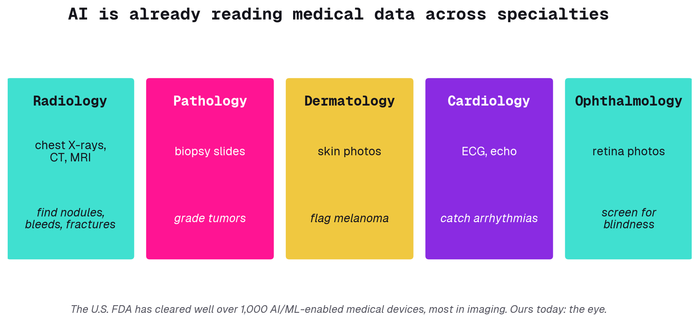

---

## What diabetic retinopathy does to the eye

Diabetes slowly damages the tiny blood vessels at the back of the eye. They leak, bleed, and eventually sprout fragile new vessels that can destroy vision. It is one of the leading causes of blindness in working-age adults. The cruel part: caught early and treated, almost all of that blindness is preventable.

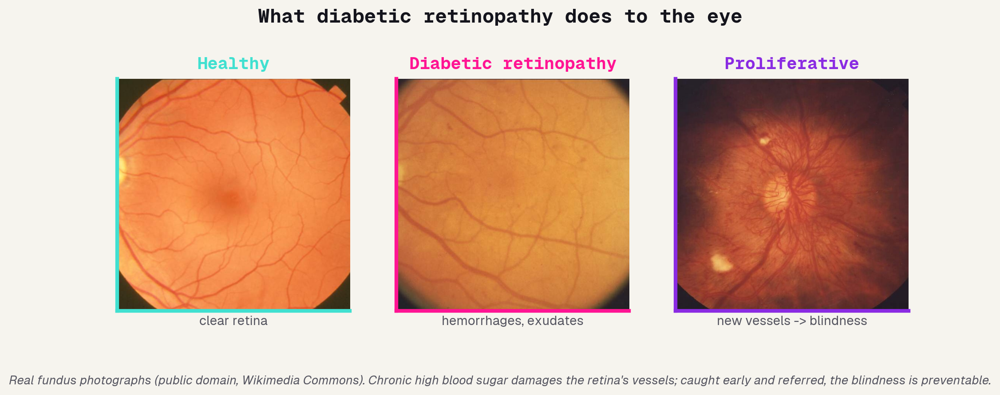

---

## A screening problem AI was built for

Hundreds of millions of people have diabetes, and every one of them should have their eyes checked each year. There are nowhere near enough eye specialists to do it, especially in rural and low-income areas. So millions go unscreened and lose vision they did not have to. That gap, huge need and scarce experts, is exactly where automated screening helps.

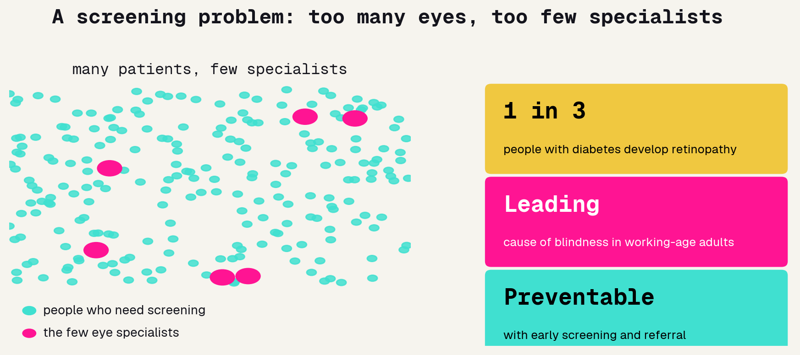

---

## From research to the clinic, fast

This is one of the clearest success stories in medical AI, and it happened quickly. In a few years it went from a research paper to an FDA-authorized device that makes a screening decision on its own, to real clinics in India and Thailand.

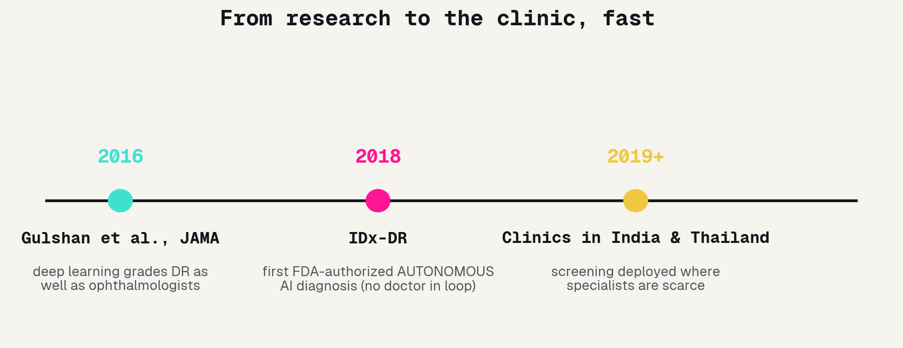

---

## Reading the retina

Eye doctors grade diabetic retinopathy on a scale from 0 to 4, from no disease to sight-threatening. For screening, all that detail collapses to one yes/no line: grade 2 or worse means refer this patient to a specialist. That single line, refer or not, is the task you will build a model for all afternoon.

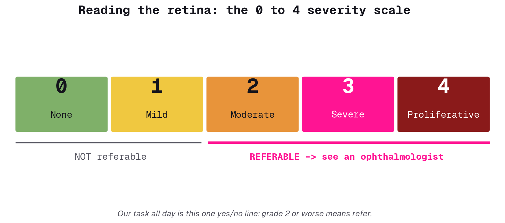

---

## How these systems fail

Medical AI is powerful, but knowing how it breaks is the real skill, and the failures are subtle.

### Shortcut learning
The model reads the ruler in the image, not the tumor. It latches onto the wrong cue.

### Distribution shift
Your hospital is not the training hospital. Accuracy quietly drops on new cameras and new populations.

### Overconfidence
"90% sure" can mean almost nothing if the model was never calibrated. Confident and wrong is the dangerous combination.

### Automation bias
When the AI is usually right, people stop checking. The rare miss then sails straight through.

---

# What is an image

---

## An image is just numbers

Before any model can learn, the picture has to become numbers. A grayscale image is one grid of brightness values. A color image is three grids stacked: red, green, blue. The model never sees a photo, it sees a spreadsheet.

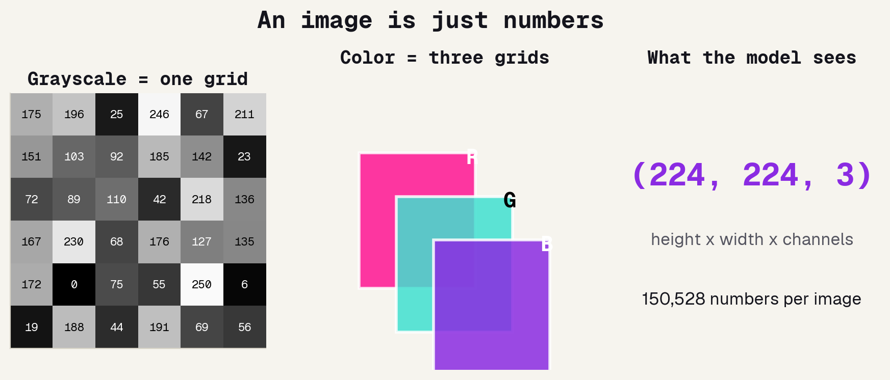

---

## Augmentation: free training data

We never have as many labeled medical images as we want. Augmentation is a cheap trick: take each image and make small changes that do not change the answer. The eye is still the same eye whether you flip it or brighten it, but to the model it is a brand new set of numbers. More variety, less memorizing, no new patients required.

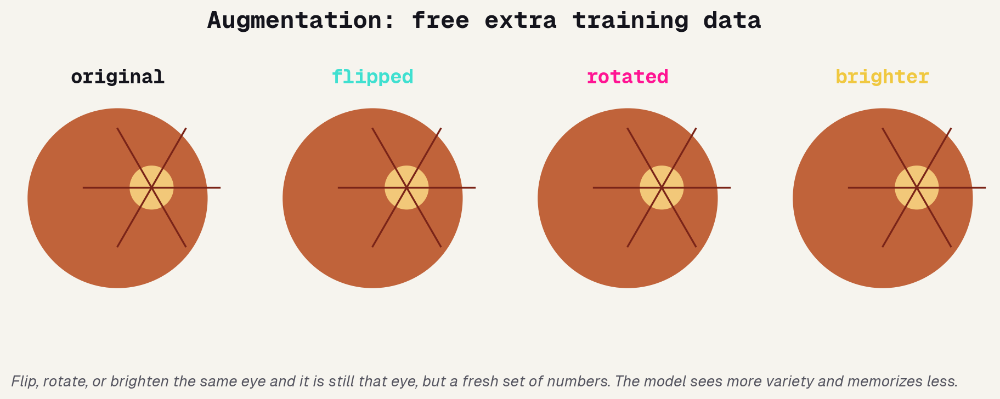

---

# How a model learns

---

## A classifier is a function

Demystify the word "model". A classifier is just a function: numbers go in, a label comes out. What "learning" means is mechanical, not magical, and it is the same for all five models we build. What changes is only how much structure the function is allowed to see.

### Input
A pile of numbers: the image, flattened or kept as a grid.

### f(x)
The model: millions of adjustable knobs.

### Output
A label: refer this eye to a doctor, or not.

---

## Split the data: learn, tune, grade

The most important habit in machine learning, and the easiest to get wrong. We split the data into three piles. The model learns from one, we tune our choices on another, and we save a third that the model never sees until the very end. Testing on data the model already studied is like grading a student on the exact questions they practiced: it looks great and means nothing.

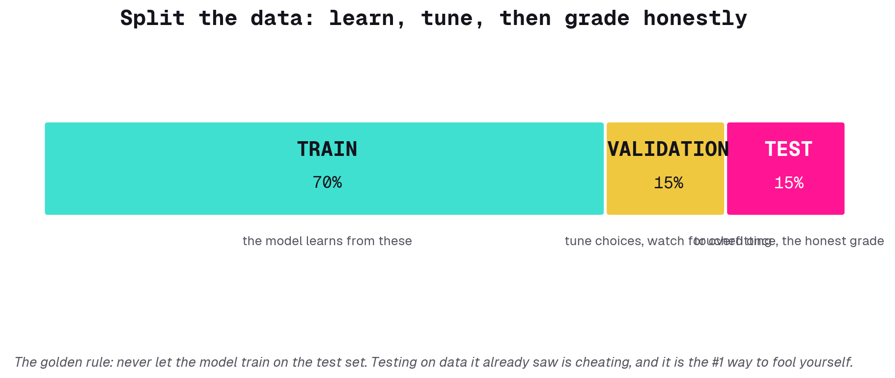

---

## Learning = rolling downhill

So how do the knobs actually get set? The model makes guesses, measures how wrong it is (the "loss"), and nudges every knob a little in the direction that makes it less wrong. Repeat millions of times and the error rolls downhill into a valley. That is gradient descent, the engine under every model today.

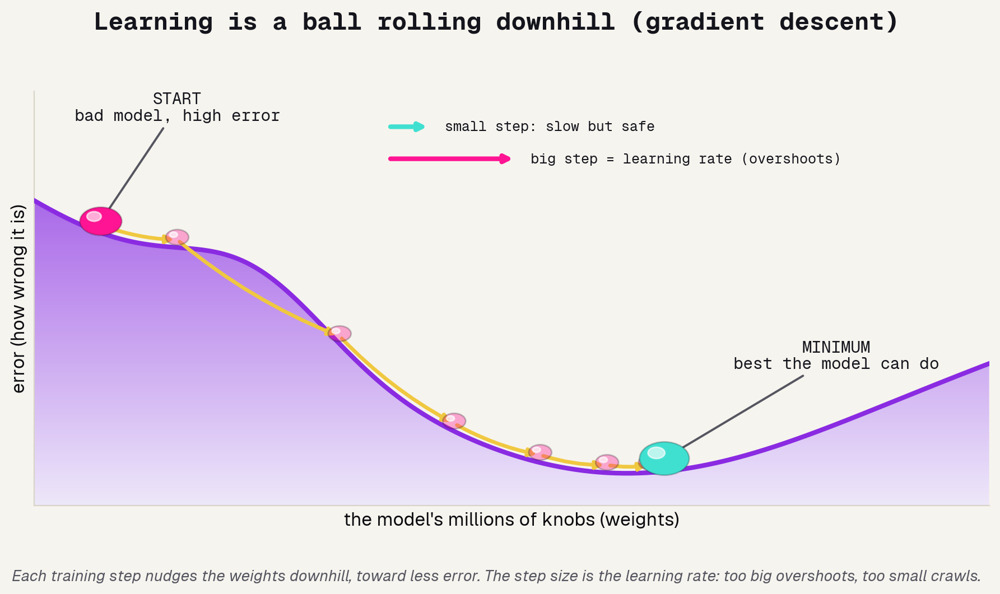

---

## Overfitting: memorizing vs learning

There is a failure mode that fools beginners and experts alike. If you train too long, the model stops learning the disease and starts memorizing the exact training images. It aces the data it has seen and flops on anything new. We catch it by watching the validation pile: when training accuracy keeps climbing but validation stalls, that is the warning light.

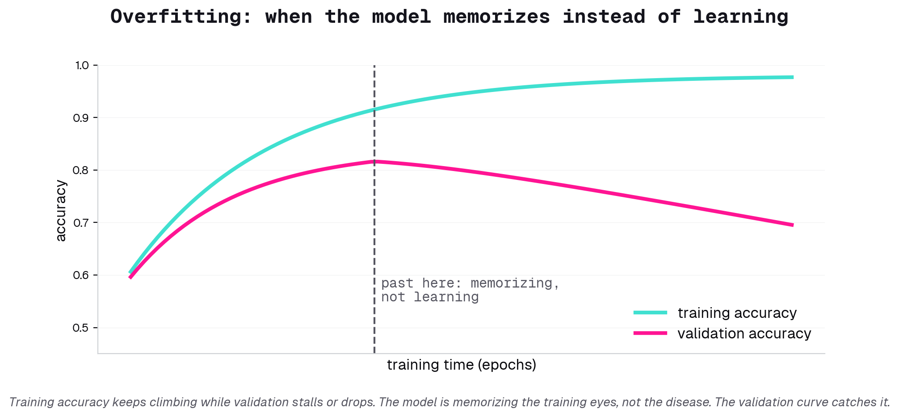

---

# Five models, one ladder

---

## The ladder we build

We solve the same task five ways, each rung able to see more structure than the last, and we watch the accuracy climb. You fill in the missing pieces of each one in the lab. Same data, five models, one clear story.

---

## Rungs 1 and 2: flatten the pixels

The two simplest models throw away the picture and treat it as one long list of numbers.

### Logistic regression
Flatten the image into a row, draw one straight-line boundary between refer and clear. The simplest thing that works, and a fine sanity check.

### MLP (a small neural net)
Stack a few layers so the boundary can bend. More flexible than logreg, but it still sees a flat list of numbers with no idea which pixels sit next to which.

---

## Rung 3: the CNN sees structure

This is the jump that matters. A plain network treats every pixel as unrelated to its neighbors, which is absurd for an image. A convolutional network slides one small filter across the whole image, so if it learns to spot a hemorrhage in one corner, it spots it anywhere. That shared filter is what "seeing spatial structure" means.

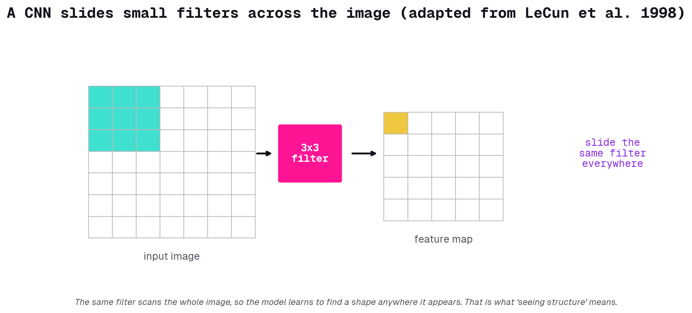

---

## Rung 4: ResNet borrows a trained brain

Training a deep network from scratch on a few thousand medical images is hard. ResNet brings two ideas: a skip connection that lets networks get very deep without falling apart, and the option to reuse a network already trained on a million everyday photos. We freeze that borrowed vision and teach only a small new final layer. This is the single biggest practical trick in modern vision.

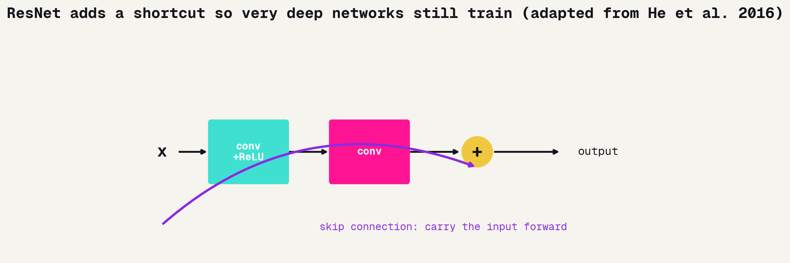

---

## Rung 5: the Vision Transformer

The newest rung, and the bridge to tomorrow. It throws out convolutions: chop the image into patches, turn each into a vector, and let the patches use attention to decide which of them matter to each other. Keep this one in mind, because it is the same machinery as the language models we use on Day 2.

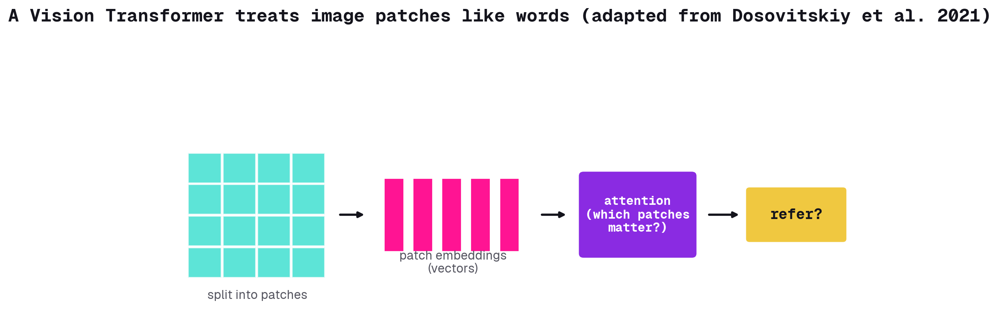

---

# Did it work?

---

## Accuracy can lie

Before we trust any number, a warning. Most patients screened are healthy, so a lazy model that refers nobody can score 90% accuracy while missing every single sick patient. In medicine that "accurate" model is worthless, even dangerous. One number is never enough.

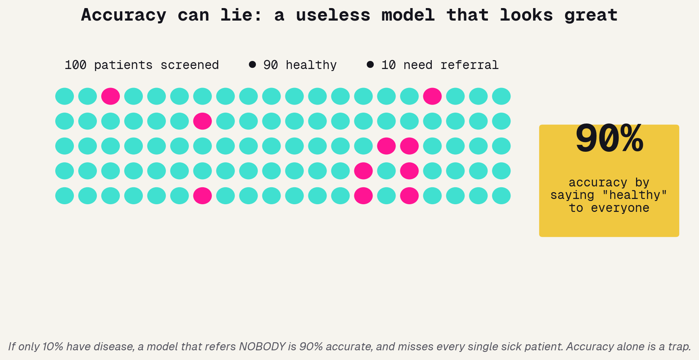

---

## The confusion matrix

Instead of one number, we look at four outcomes. The model can correctly refer or correctly clear, or it can make two very different mistakes: a false alarm, or a missed case. The whole point: those two errors are not equal. Missing a referral can mean preventable blindness; a false alarm is a wasted visit.

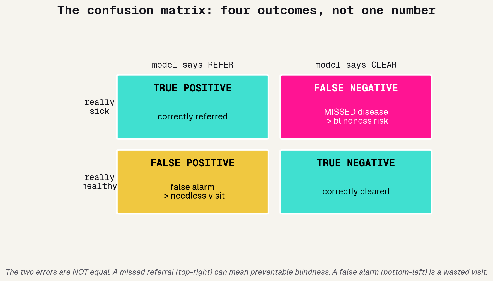

---

## The two numbers that matter

From those four outcomes come the two numbers clinicians actually care about. Sensitivity asks: of the truly sick, how many did we catch? Specificity asks: of the truly healthy, how many did we correctly clear? A screening tool lives and dies on sensitivity, because the cost of a miss is so high.

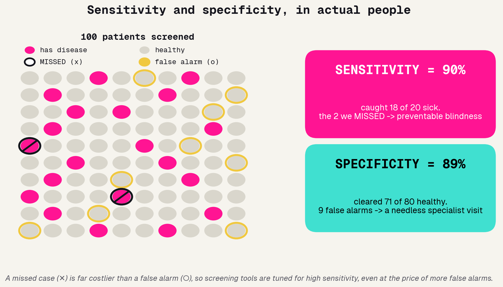

---

## You choose the trade-off

Here is the part students find surprising: the model does not hand you one answer, it hands you a dial. Lower the bar for referral and you catch more disease but raise more false alarms. There is no setting that wins on both. The clinical context, not the algorithm, decides where to put the dial.

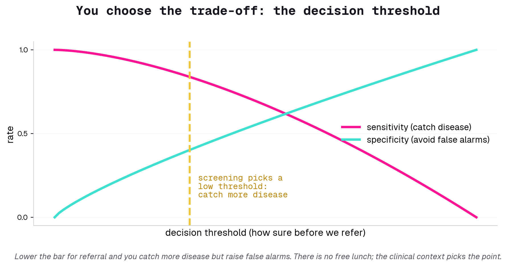

---

## Reading an ROC curve

Every threshold you could pick traces out one curve: the ROC. It plots catch rate (sensitivity) against false-alarm rate as you slide the dial. One picture summarizes every operating point at once. The closer it hugs the top-left, the better the model, and the area under it (AUC) is the single number people quote. This is the chart you will stare at most when you judge a medical model.

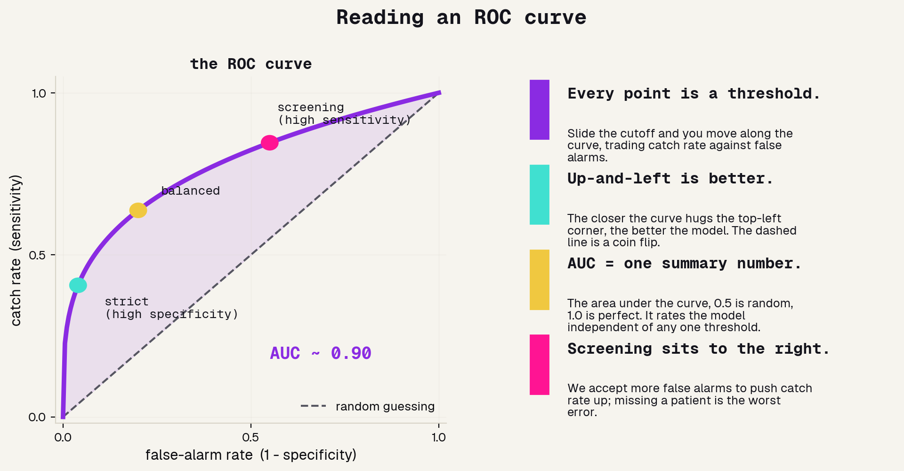

---

# The lab

---

## How the lab works

One notebook. Fill in the `# TODO` blanks, run the cell, read the accuracy. The point is not to finish first, it is to understand why each rung beats the last.

### Fill the blanks
Each model step has 2-3 missing lines. Write them, run it, see the number.

### Predict, then check
Before each model, guess its accuracy. Being wrong is how the intuition forms.

### Ask for help
Stuck on a blank? Ask me, or ask Claude. Both are fair game.

---

## Using Claude well

You all have Claude. In the real world it is an auto-programming tool that takes an idea to a result. Watch how I use it on one TODO, then it is yours.

### Ask clearly
Give it the goal and the context, not just "fix this".

### Read the answer
I read what it writes. I do not paste blindly.

### Own it
The one rule all week: always be able to explain what your code does.

---

# What you built

---

## The leaderboard you built

Same eye scans, five models. The flat-pixel models hover near a coin flip. The CNN edges up because it sees structure. Then transfer learning takes a leap. That jump is the lesson.

---

## Where the data comes from matters

A model is only as fair as the data it learned from. Real medical AI has been caught working worse on the groups least represented in its training set. This is not a side issue, it is the issue.

### Whose eyes?
If training data skews to one country, age, or camera, the model can quietly underperform on everyone else.

### Consent and privacy
These are real patients. Who agreed to this use, and how is the data protected?

### Fairness is testable
The honest move: report accuracy per subgroup, not just overall. A good average can hide a bad gap.

---

## The bridge to tomorrow

The Vision Transformer worked by splitting the image into patches and letting them attend to each other. Swap patches for words and you have a language model. Same machinery, different input. Tomorrow we use one to read radiology reports.

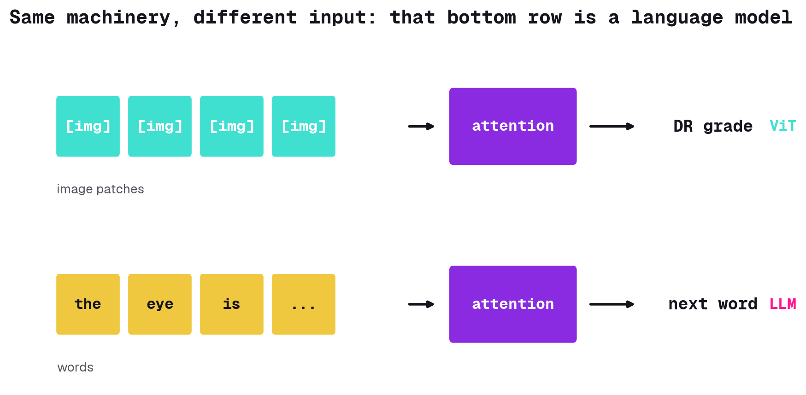
