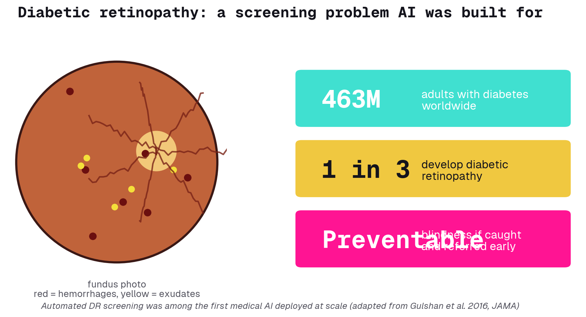

# Why this matters

---

## AI already screens for blindness

Diabetic retinopathy is damage to the back of the eye from diabetes. Caught early and referred to a doctor, the blindness it causes is preventable. The problem is scale: there are far more diabetic eyes than specialists to read them. That is exactly the gap automated screening was built to close.

- **The data:** color photos of the retina, the back of the eye
- **The task:** does this eye need to see a doctor? Yes or no
- **Why it's famous:** among the first medical AI deployed at scale in real clinics

---

## Real systems, real failure modes

Medical AI is already in clinics. Knowing how it breaks is the actual skill.

### Deployed today
DR screening in India and Thailand, FDA-cleared mammogram triage, sepsis early-warning in hospital records.

### Shortcut learning
The model reads the ruler in the image, not the tumor. It learns the wrong cue.

### Distribution shift
Your hospital is not the training hospital. Accuracy quietly drops on new equipment and new populations.

### Overconfidence
"90% sure" can mean almost nothing if the model was never calibrated. Confident and wrong is the dangerous combination.

---

# What is an image

---

## An image is just numbers

Before any model can learn, the picture has to become numbers. A grayscale image is one grid of brightness values. A color image is three grids stacked: red, green, blue. The model never sees a photo, it sees a spreadsheet.

- **One pixel:** a brightness value from 0 to 255
- **One color image:** 224 x 224 x 3, about 150,000 numbers
- **Augmentation:** flip, rotate, brighten the same eye, and the model sees more variety without new data

---

# What is learning

---

## A classifier is a function

Learning means tuning a function until its answers match the truth. Same input every time (the numbers), same kind of output (a label). What changes from model to model is how much structure the function can see.

### Input
A pile of numbers: the image, flattened or kept as a grid.

### Output
A label: refer this eye to a doctor, or not.

### "Learning"
Adjust the function's knobs until its guesses line up with the real answers on examples we already know.

---

## Five models, one ladder

We build the same task five ways, each rung seeing more structure than the last. You write the missing pieces; the accuracy climbs as you go.

### 1. Logistic regression
Flatten the image, draw one straight-line boundary. The simplest thing that works.

### 2. MLP
A small neural net. Curved boundaries now, but still blind to space.

### 3. CNN
Slides filters across the image. Finally understands that nearby pixels form shapes.

### 4. ResNet
A 50-layer network pretrained on a million photos. We reuse its vision.

### 5. Vision Transformer
Splits the image into patches that pay attention to each other. The bridge to tomorrow.

---

## The CNN sees structure

A plain neural net treats every pixel as unrelated. A convolutional network slides a small filter across the whole image, so it learns to spot an edge or a lesion anywhere it appears. That shared filter is the whole idea.

---

## ResNet: borrow a trained brain

Training a deep network from scratch on a small medical dataset is hard. ResNet's trick is twofold: a skip connection that lets very deep networks train at all, and ImageNet pretraining we can reuse. We freeze the borrowed vision and teach only a new final layer.

---

## Vision Transformer: patches that attend

The newest rung. Chop the image into patches, turn each into a vector, and let the patches decide which of them matter to each other. No convolutions at all, just attention.

---

# The lab

---

## How the lab works

One notebook. Fill in the `# TODO` blanks, run the cell, read the accuracy. The point is not to finish first, it is to understand why each rung beats the last.

### Fill the blanks
Each model step has 2-3 missing lines. Write them, run it, see the number.

### Predict, then check
Before each model, guess its accuracy. Being wrong is how the intuition forms.

### Ask for help
Stuck on a blank? Ask me, or ask Claude. Both are fair game.

---

## Using Claude well

You all have Claude. In the real world it is an auto-programming tool that takes an idea to a result. Watch how I use it on one TODO, then it is yours.

### Ask clearly
Give it the goal and the context, not just "fix this".

### Read the answer
I read what it writes. I do not paste blindly.

### Own it
The one rule all week: always be able to explain what your code does.

---

# What you built

---

## The leaderboard you built

Same eye scans, five models. The flat-pixel models hover near a coin flip. The CNN edges up because it sees structure. Then transfer learning takes a leap. That jump is the lesson.

---

## The bridge to tomorrow

The Vision Transformer worked by splitting the image into patches and letting them attend to each other. Swap patches for words and you have a language model. Same machinery, different input. Tomorrow we use one to read radiology reports.

