# Where we are

---

## Yesterday, and today

Yesterday we pointed one big neural network at eye photos and watched it learn to screen for blindness. Today we change two things at once: a new kind of data (chest X-rays, which come with written reports), and a new idea (combine several signals about a patient instead of just one image). Same goal as ever: a model that helps a clinician decide.

### Day 1
One image, one end-to-end network, the eye.

### Day 2
Image plus text plus patient data, combined, on the chest.

### The throughline
Medicine is multimodal. Real decisions use the scan AND the notes AND the history.

---

## One chest X-ray, many findings

The chest X-ray is the most common imaging test in the world. A single image can reveal the heart, the lungs, and the space around them, and a radiologist reads several possible findings from it at once.

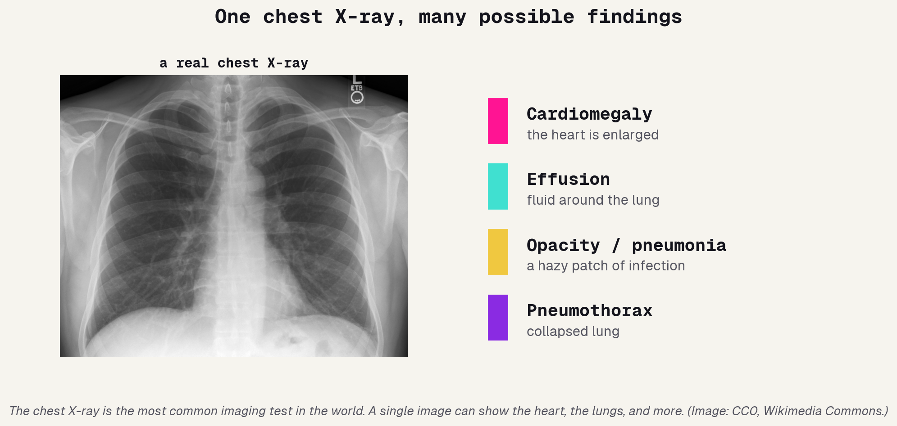

---

## What is cardiomegaly?

Our target today is cardiomegaly: an enlarged heart. How does a radiologist actually decide? They measure the cardiothoracic ratio, the width of the heart divided by the width of the chest. On a normal chest the heart takes up less than half; once it crosses about 0.50, it counts as enlarged. So our yes/no label has a real, physical definition, it is not arbitrary.

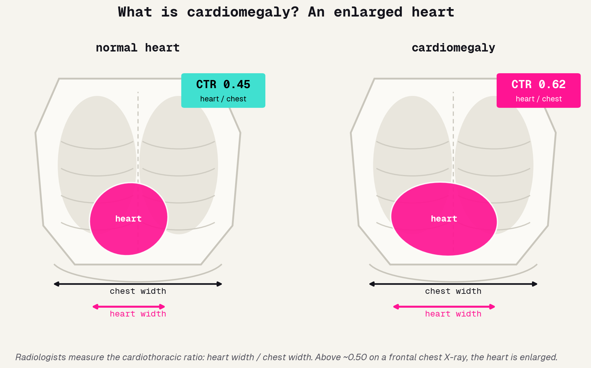

---

## Every scan comes with text

Here is what makes chest imaging different from yesterday. Each scan is paired with a radiology report: the radiologist's written findings and impression. That text is data too, and historically it is where most of the clinical signal was recorded. If we can read it automatically, we unlock a whole second channel.

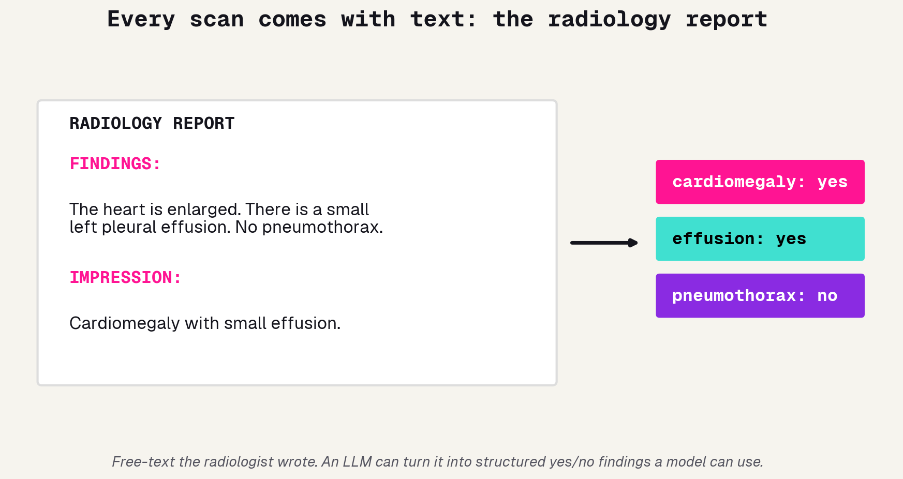

---

# What is a language model

---

## The bridge from yesterday

Yesterday's Vision Transformer split an image into patches and used attention to decide which patches mattered. A language model does the exact same thing with words instead of patches. That bottom row is an LLM. So none of today is magic, it is the same machinery you already built, pointed at text.

---

## Tokenization: text becomes numbers

A model cannot read letters any more than it could read a photo. So text is chopped into tokens (whole words or word-pieces), and each token is looked up as a number. "Enlarged" might become "en" + "larged". Once text is numbers, the same attention machinery from the ViT takes over.

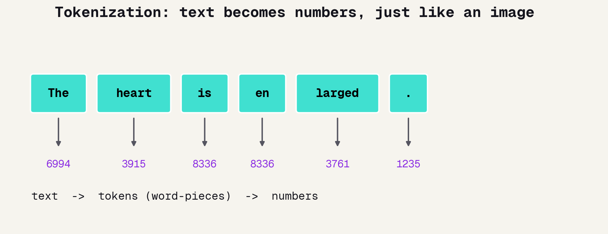

---

## Attention: which words matter

Given a report, the model does not weigh every word equally. Through attention it learns that "heart" and "enlarged" carry the signal while "the" and "is" are filler. This is how an LLM extracts meaning, and it is the same mechanism that let the ViT focus on the diseased part of an image.

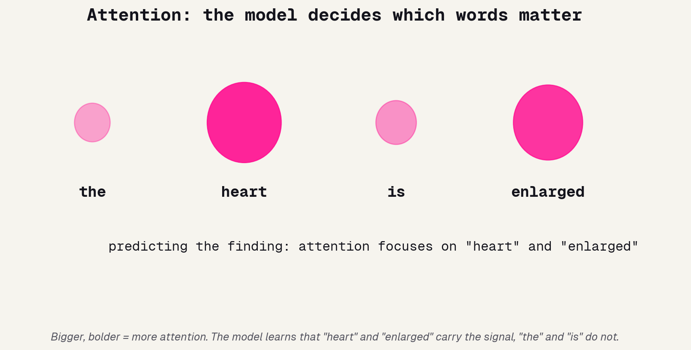

---

## What an LLM actually does

Strip away the hype and an LLM does one thing: predict the next token, over and over, from everything it has seen before. That simple objective, at enormous scale, is enough to summarize, answer questions, and pull structured facts out of messy text. But "predict something plausible" is not the same as "tell the truth", which leads straight to the danger.

### The objective
Predict the next word-piece. That is it.

### What it buys
Summarize, extract, answer, structure free text.

### The catch
Plausible is not the same as correct.

---

## Hallucination: confident, fluent, wrong

When an LLM does not know, it does not stop, it invents. It will produce a fluent, confident, completely fabricated answer. For a chatbot that is annoying; in medicine a confident wrong answer is the dangerous kind. The rule for the rest of the day: use the LLM, but verify what it says.

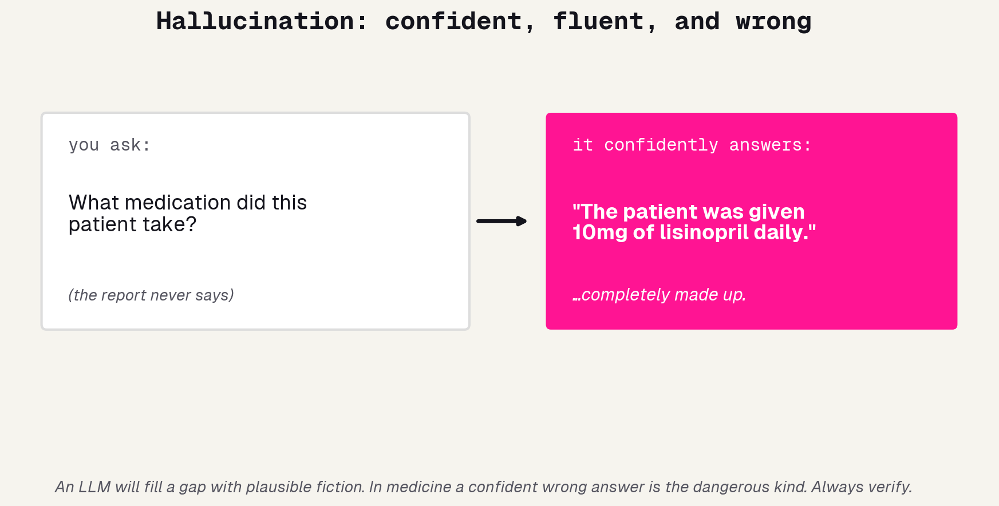

---

# The multimodal stack

---

## Three signals, one patient

Now we build the thing. For each patient we have three very different signals: the X-ray image, the report text, and basic demographics. Each is informative on its own; together they should be stronger. The whole trick of today is getting these three into a form one model can use.

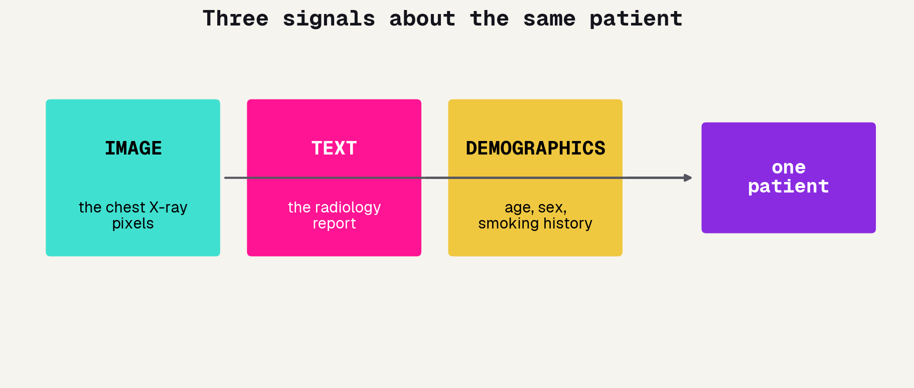

---

## Image to a vote: late fusion

First signal. How do we get the X-ray into the table? You could hand-craft a hundred radiomics numbers, or dump a 512-number embedding, but both swamp a tabular model. Instead we do something cleaner: train an actual image model (transfer learning, exactly like Day 1) and feed the table just its prediction. One probability, the image's vote. This is called late fusion, or stacking.

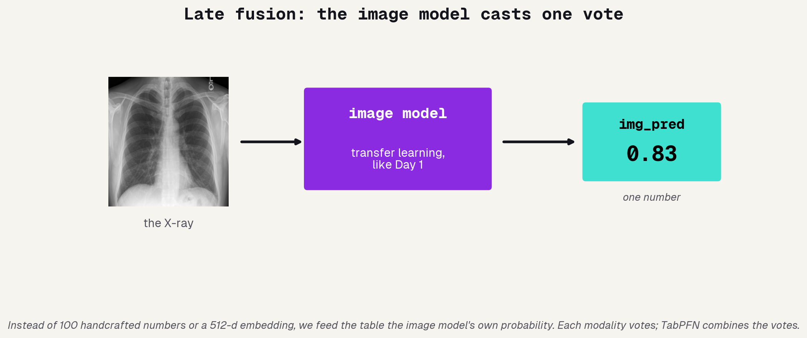

---

## One honest catch: out-of-fold

There is a subtle trap in stacking. If the image model scores a patient it was trained on, that score is too optimistic, it has effectively seen the answer. So when the instructor pre-computed every patient's `img_pred`, each one came from a model trained only on the *other* patients (this is called out-of-fold, or cross-validation). It is the same fairness instinct that runs through the whole day: never let a model grade itself.

### The trap
A model is overconfident on data it trained on.

### The fix
Score each patient with a model that never saw them.

### Why it matters
Otherwise the image vote silently cheats, before the text even gets a chance to.

---

## Text to numbers: the LLM extracts findings

Second signal. We hand each report to a language model and ask it for structured findings: cardiomegaly yes/no, effusion yes/no, and so on. Those yes/no answers become numbers. Because calling the model on hundreds of reports costs money and time, the instructor pre-ran it and saved the results, so in the lab you load the answers, no API key needed.

### The prompt
"Read this report. Return the findings as JSON."

### The output
A handful of yes/no flags per patient.

### Pre-cached
You load the saved answers; the one live call is the instructor's demo.

---

## Everything becomes one tabular row

This is the big idea of the day, and it is beautifully simple. The image model's vote is a number. Text features are numbers. Demographics are numbers. Lay them side by side and every patient is just one row in a table, with a label to predict. We have turned a messy multimodal problem into a spreadsheet.

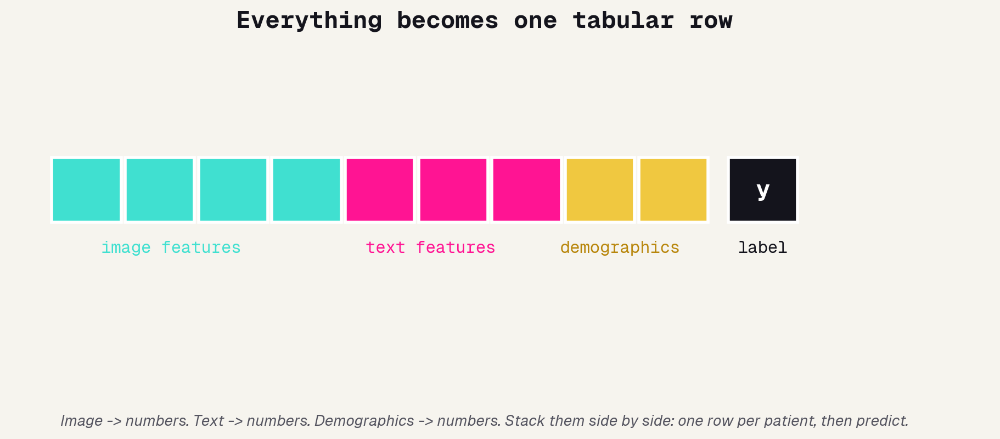

---

## TabPFN: a foundation model for tables

So who predicts from the table? Not a network you train for hours. TabPFN is a foundation model pretrained on millions of synthetic tables; you "fit" it (it just studies your examples) and "predict", both in seconds. It is the same shift you saw with ImageNet pretraining yesterday, now for tabular data.

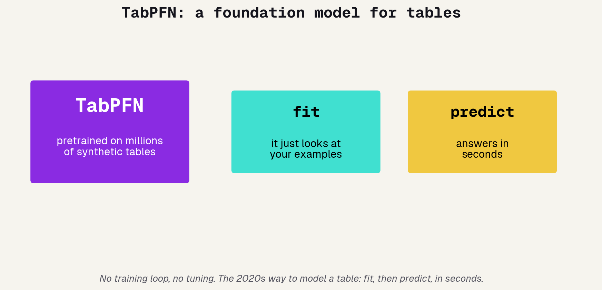

---

# Did it work?

---

## Adding text looks amazing

Run it. The image vote plus demographics alone lands around 72%, a real, honest signal from the pixels. Add the LLM-extracted text features and it jumps to about 98%. A huge gain from one extra signal. If we stopped here we would high-five and publish. But that jump should make you suspicious, not excited.

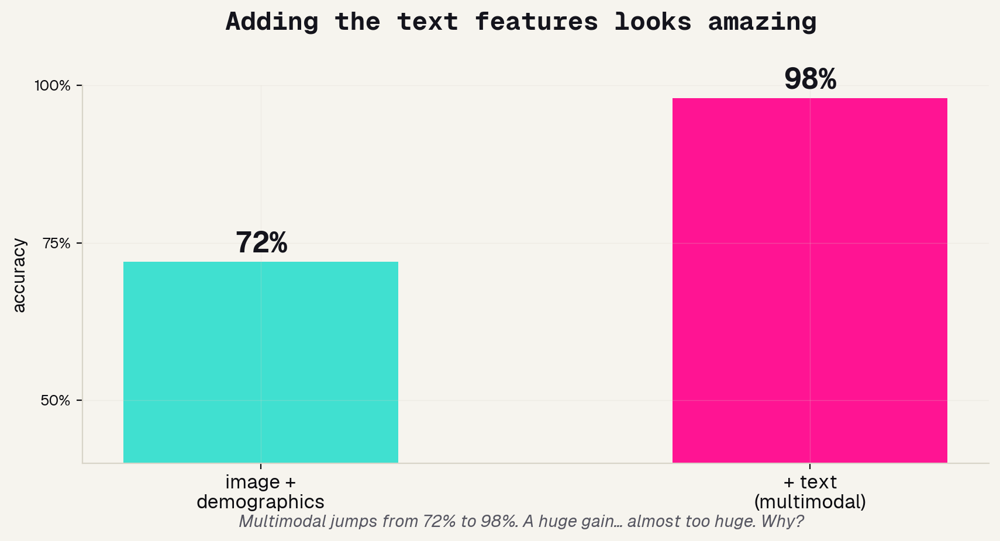

---

## Wait, that is too good

Here is the catch, and it is the most important lesson of the day. The report we read the text from literally says the diagnosis we are trying to predict. The LLM's "cardiomegaly: yes" matches the true label almost perfectly. The model is not predicting disease, it is copying the answer off the report.

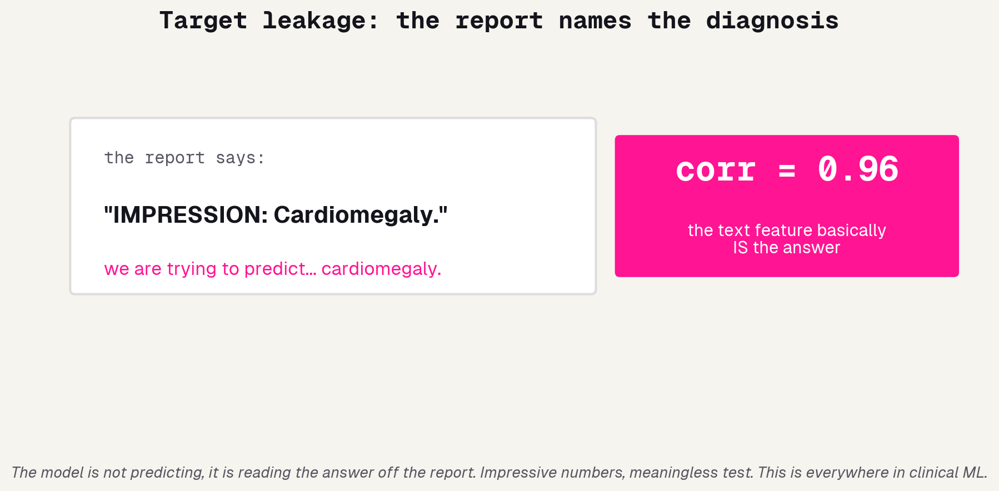

---

## What a fair test looks like

This trap is called target leakage, and catching it is real expertise. The fix is to be honest about what counts as a fair input.

### No peeking at the label
A feature that encodes the answer is not allowed. The report's impression is basically the answer.

### Use inputs that precede the label
Fair signals exist before the diagnosis is known: the raw pixels, the demographics.

### Report it honestly
Show the leaked and de-leaked numbers side by side. The honest result is lower, and real.

---

# The lab

---

## How the lab works

Same format as yesterday: one notebook with `# TODO` blanks. You will assemble the three feature groups into one table, hand it to TabPFN, read the accuracy, and then run the ablation that exposes the leakage yourself.

### Fill the blanks
Build the feature table, call TabPFN's fit and predict.

### Run the ablation
Drop the text features, refit, compare. Watch the gap.

### Discuss
Was that a fair test? What would you change?

---

## Using Claude, and the API budget

Claude is your pair programmer again today. One extra wrinkle: real API calls cost money, which is why we pre-cached the report extractions. You see one live call in the demo; the rest you load from disk.

### Pair programmer
Stuck on a blank? Ask Claude, then make sure you understand the answer.

### Cost discipline
Pre-caching is how real teams keep LLM bills sane. Cache once, reuse many times.

### The rule, still
Always be able to explain what your code does.

---

# What you built

---

## Two paradigms, both yours now

Step back. In two days you have built the two dominant approaches in medical AI. Yesterday: feed raw data to one big network that learns its own features. Today: turn everything into handcrafted features and let a foundation model handle the table. Knowing which to reach for is half the job.

---

## Text data is even more sensitive

A closing caution, because today's new signal carries new risk. Clinical notes are full of identifying detail, far more than a pixel grid. Handling text responsibly is its own skill.

### Hidden identifiers
Notes mention names, dates, places. "De-identified" text often is not, fully.

### The model can leak it
LLMs can repeat training text verbatim. Sensitive notes in, sensitive notes out.

### Minimize and protect
Use the least data that does the job, and guard it like the patient record it is.

---

## Tomorrow: build your own

You now have the whole toolkit: end-to-end deep learning, transfer learning, multimodal feature stacks, and a foundation model. Tomorrow you pick a problem, grab a dataset, and build something start to finish, with Claude as your engineer. See you there.
