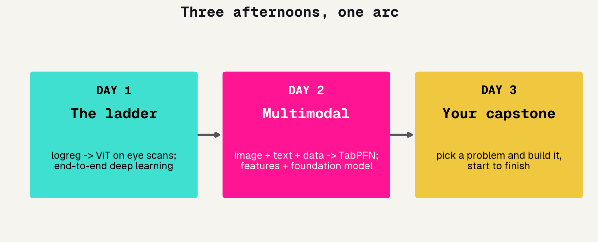
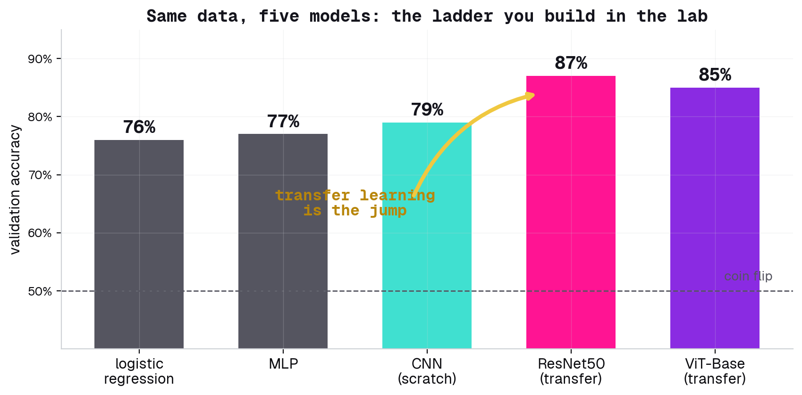
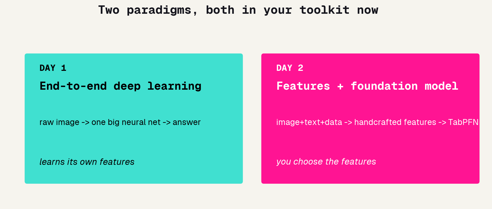
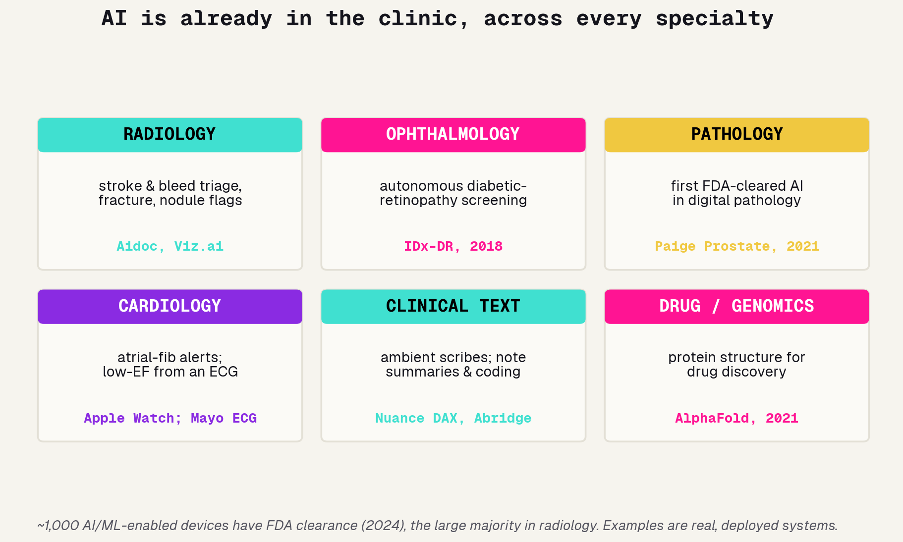
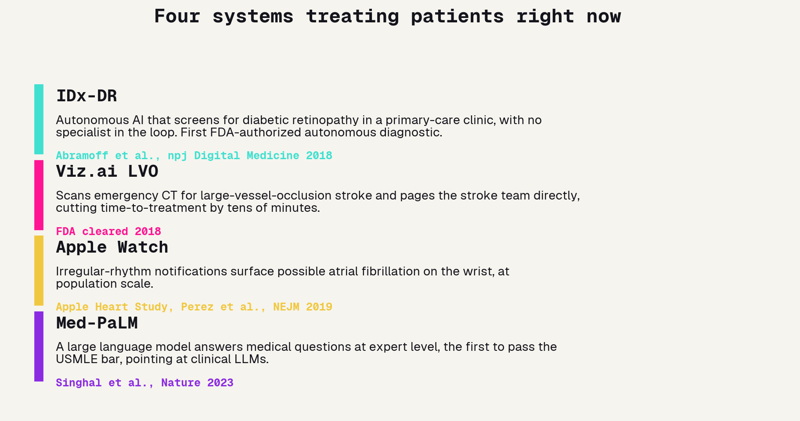
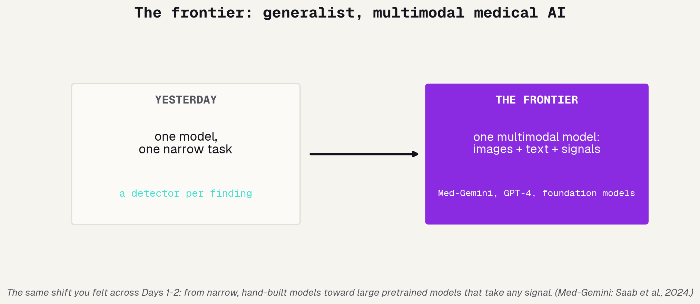
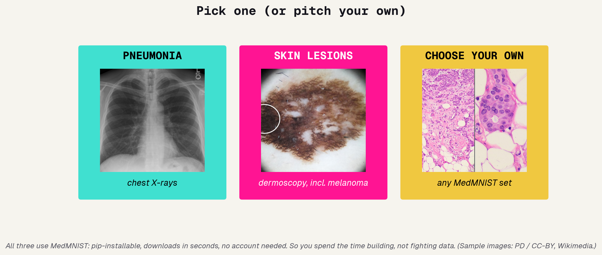
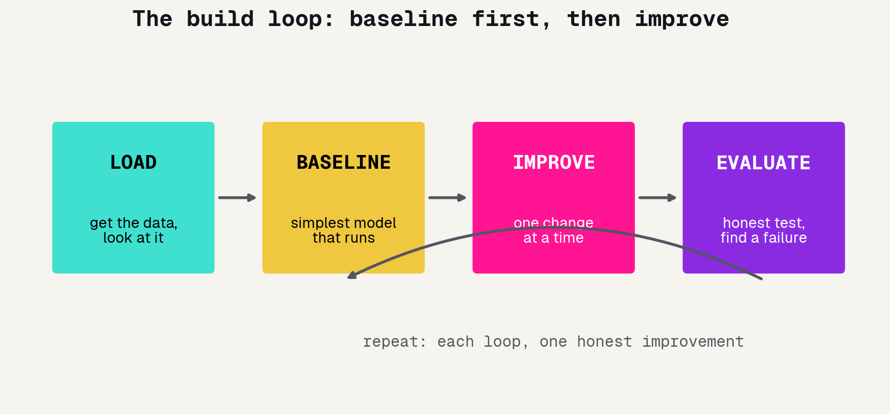
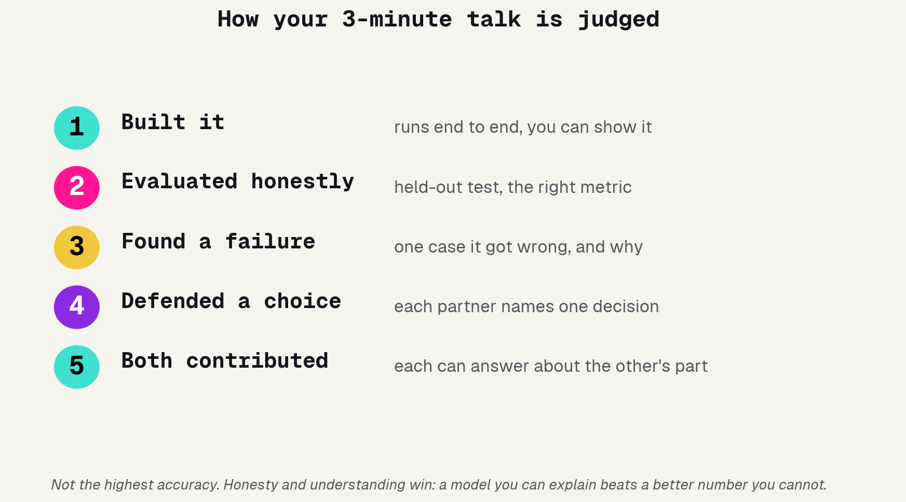
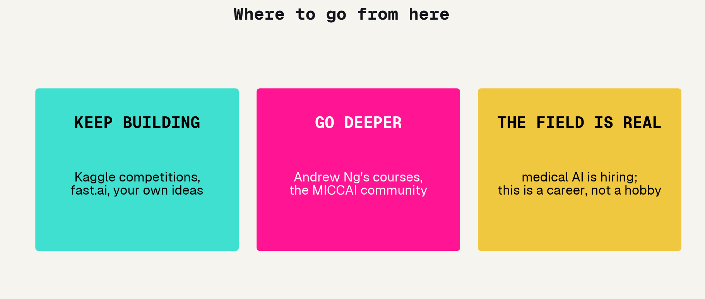

# The journey so far

---

## Three afternoons, one arc

Look how far you have come. Day 1 you built five models on eye scans and learned that borrowed knowledge beats from-scratch. Day 2 you combined an image, a report, and patient data, and learned to distrust a too-good number. Today you put it together and build something of your own.

---

## What Day 1 taught you

The ladder. The same task, five ways, each seeing more structure than the last. The lasting lesson was not any one model, it was the jump: a network pretrained on a million ordinary photos, reused for eyes, beat anything we trained from scratch. When in doubt, start from something pretrained.

---

## What Day 2 taught you

Two paradigms, and a warning. You learned to turn an image, a report, and demographics all into one table and let a foundation model handle it. And you learned the most important habit in the field: when a result looks too good, hunt for the leak before you celebrate.

---

## Everything in your toolkit now

You are not starting today from zero. You have a real, working toolkit, the same one a junior medical-AI engineer uses.

### Models
logreg, MLP, CNN, transfer learning, vision transformers, TabPFN.

### Method
train/val/test, gradient descent, augmentation, watching for overfitting.

### Judgment
sensitivity vs specificity, confusion matrices, spotting leakage, fairness.

---

# Where the field stands

---

## AI is already in the clinic

Before you build your own, look at the field you are joining. AI is not a someday-in-medicine story; it is already deployed across nearly every specialty, from radiology to pathology to cardiology. Around a thousand AI/ML-enabled devices have FDA clearance, and the examples below are real systems used on real patients.

---

## Four systems treating patients now

A few flagships worth knowing by name. Each one is a real, regulated product, and each maps onto something you built this week: a screening classifier, a triage detector, a wearable signal, a clinical language model. You now understand, at least in outline, how every one of these works.

---

## The frontier: multimodal medical AI

Where is it heading? Away from one narrow model per task and toward large, pretrained, multimodal models that take an image, a report, and a lab value together, exactly the late-fusion idea from Day 2, scaled up. That is the same arc you felt across these three afternoons.

---

## Where it still breaks

A grounding caution before you build. Deployed does not mean flawless. A widely used hospital sepsis-prediction model, live in hundreds of hospitals, was found in external validation to miss most cases and flood clinicians with false alarms. The usual culprits are the ones you already met: a model that never saw truly held-out data, a metric that hid the failure, and leakage.

### Dataset shift
A model trained at one hospital can quietly fail at another.

### The wrong metric
High accuracy can still mean most real cases are missed.

### Leakage, again
The Day 2 trap is everywhere; honest evaluation is the antidote.

---

# Today's mission

---

## The capstone format

Today is mostly hands-on. A short kickoff, a long build sprint in pairs, then everyone presents. The goal is not a perfect model, it is a real one you understand and can talk about.

### Pairs
Two people, one project. Both of you build, both of you present.

### Build sprint
About ninety minutes. I will circulate; check in at 3:15 and 4:00.

### Present
Three minutes each pair at 4:30. Show what you built.

---

## Pick one, or pitch your own

Three starter problems, each with a working notebook you extend. All use MedMNIST, so the data downloads in seconds and you spend your time building, not wrangling files. Want something else? Pitch it to me in the first ten minutes.

---

## How to choose your project

Do not overthink this. Any of the three is a great afternoon. Pick on gut.

### Closest to what you know
Pneumonia is the most like Day 2. A safe, satisfying choice.

### Most interesting to you
Melanoma detection feels high-stakes and real. Follow curiosity.

### Most room to explore
MedMNIST has a dozen datasets. Pick a weird one and surprise yourself.

---

# How to build it

---

## The build loop

Real model-building is a loop, not a straight line. Load the data and actually look at it. Get the simplest thing running. Improve it one change at a time. Evaluate honestly. Then go around again. Most beginners skip the baseline and over-engineer; do the opposite.

---

## Step 1: get a baseline running

The first goal is not a good model, it is a model that runs end to end and gives a number, however bad. A working baseline is your safety net: now every change can be measured against it. Resist the urge to make it fancy before it works at all.

### Make it run
End to end, even if accuracy is terrible.

### Get a number
That number is your baseline to beat.

### Only now, improve
A change you cannot measure is a change you cannot trust.

---

## Step 2: improve, one change at a time

Now iterate, but scientifically. Change one thing, re-measure, keep it only if it helped. Train longer, unfreeze the backbone, add augmentation, try a bigger image size. If you change five things at once and accuracy moves, you have learned nothing about why.

### One change
Isolate it. Re-run. Compare to baseline.

### Keep what helps
Did the number actually move beyond noise?

### Log it
"Augmentation: +3 points." That sentence is half your presentation.

---

## Step 3: debug like an engineer

Things will break, and that is normal. The skill is not avoiding errors, it is reading them. Print shapes, read the actual error message, change one thing, try again. And when you are stuck, Claude is right there.

### Read the error
The message usually says exactly what is wrong. Read it before guessing.

### Print shapes
Most bugs are a shape mismatch. `print(x.shape)` is your friend.

### Then ask Claude
Paste the error and the code. Then make sure you understand the fix.

---

## Claude is your engineer today

Days 1 and 2, Claude helped you fill in blanks. Today it is a full pair programmer: you describe what you want, it writes code, you read it, run it, fix it together. This is the real-world workflow. The one rule has not changed.

### Describe the goal
Give it context and what you want, not just "make it work".

### Build together
It drafts, you steer, you run it, you both iterate.

### Own every line
The rule all week: you must be able to explain what your code does.

---

# Evaluate honestly

---

## The four traps

You learned these the hard way over two days. Do not fall into them today.

### Accuracy lies
On imbalanced data, "always say no" can score high and be useless.

### Target leakage
A feature that secretly encodes the answer. The Day 2 trap.

### Overfitting
Great on training data, bad on new data. Watch validation.

### Cherry-picking
Reporting your one lucky run. Be honest about the typical result.

---

## What makes a good evaluation

A good result is an honest one. Test on data the model never trained on, pick the metric that matches the stakes (sensitivity for screening), and look at what it gets wrong, not just the score.

### Held-out test
Never seen during training. The only honest grade.

### The right metric
For screening, a missed case matters more than a false alarm.

### Look at failures
The cases it gets wrong are the most interesting slide in your talk.

---

## How your talk is judged

Five points, and notice what is not on the list: highest accuracy. We reward understanding and honesty. A simple model you can fully explain beats a fancier one you cannot.

---

# Present it

---

## The three-minute talk

Keep it tight. Three minutes goes fast, so show, do not tell. Open the model running, give your one best finding, and name one honest limitation. That structure alone is a great talk.

### Show it
Run the model live, or show one clear result.

### One finding
The single most interesting thing you learned.

### One limitation
What it gets wrong, or what you would do with more time.

---

## Both of you, out loud

This is a pair project, and both partners present. Decide who covers what, and make sure each of you can answer a question about the other's part. The best teams traded off and understood the whole thing, not half each.

---

# What's next

---

## Where to go from here

Today is not the end of this. If any of it clicked, there is a clear path to keep going, and it is all free or cheap.

---

## You did real work this week

Three afternoons ago, some of you had never written Python. Today you are building and evaluating medical AI on real data, and thinking critically about when to trust it. That is not a toy version of the field, it is the actual job. Go build something people want. Thank you.
