# How to use this

---

## Make the concepts physical

High schoolers learn a concept faster when they can touch it, move it, or bet on it. This deck collects the interactive and unplugged activities that pair with the three-day course. Each slide shows what the activity looks like set up, plus what you need, how to run it, and the payoff. Pick the ones that fit your room; none is required. Most run 5 to 10 minutes, and every one ends on a reveal that maps straight onto something students then see in code.

---

# Live widgets (in the notebook)

---

## Augmentation explorer

**Day 1, notebook 0.7.** Materials: a laptop on Colab, projected. Run it (5 min): have students push rotate, brightness, blur, and zoom to the extremes on a real eye, then ask which versions still look like a valid patient photo. The reveal: gentle rotations and flips are fair; heavy color or warping changes the diagnosis, which is exactly why the pipeline only uses the mild ones.

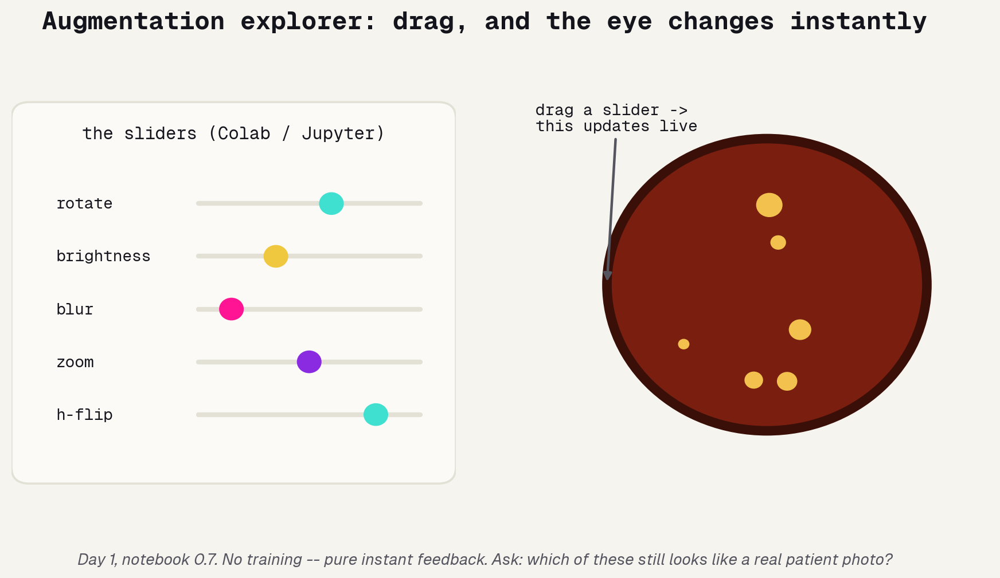

---

## Threshold slider

**Day 1, notebook 7.1, after a model is trained.** Materials: the same notebook. Run it (5 min): a volunteer sets the policy for a blindness screener by dragging the cutoff, first toward catch-everything, then toward avoid-false-alarms. The reveal: no setting wins both; the clinician, not the algorithm, picks the operating point. This is the ROC curve in their hands.

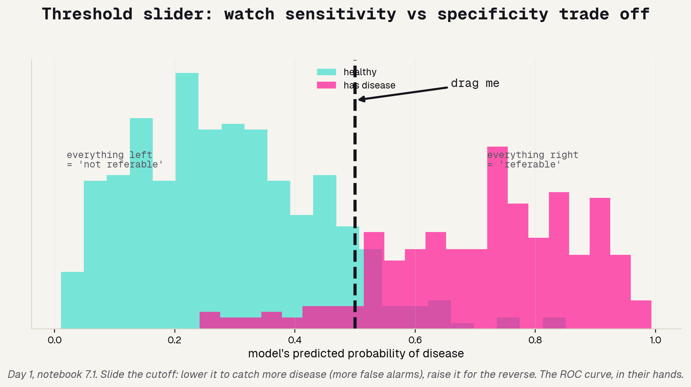

---

# Unplugged activities

---

## The Feature Ladder

**Day 1, before the model ladder. The headline activity.** Materials: seven cards on the whiteboard, each a way of looking at the eye. Run it (10 min): in pairs, rank the cards simplest to most complex, then star the one you bet is most accurate; compare across teams and argue. The reveal: their ladder is logreg to MLP to CNN to ResNet, and the borrowed pretrained brain beats the fancy from-scratch models. Complexity is not the same as accuracy.

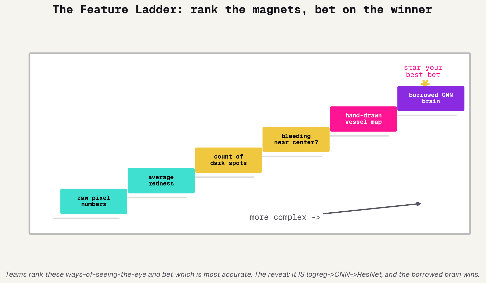

---

## Human Confusion Matrix

**Day 1, evaluation block.** Materials: four corner signs, a few students secretly labeled sick or healthy. Run it (8 min): a model student guesses each person; everyone walks to the matching corner; count bodies to compute sensitivity and specificity. Then tell the model to be more cautious and re-sort. The reveal: caution moves people between corners, and sensitivity and specificity move in opposite directions, the threshold trade-off, felt with their feet.

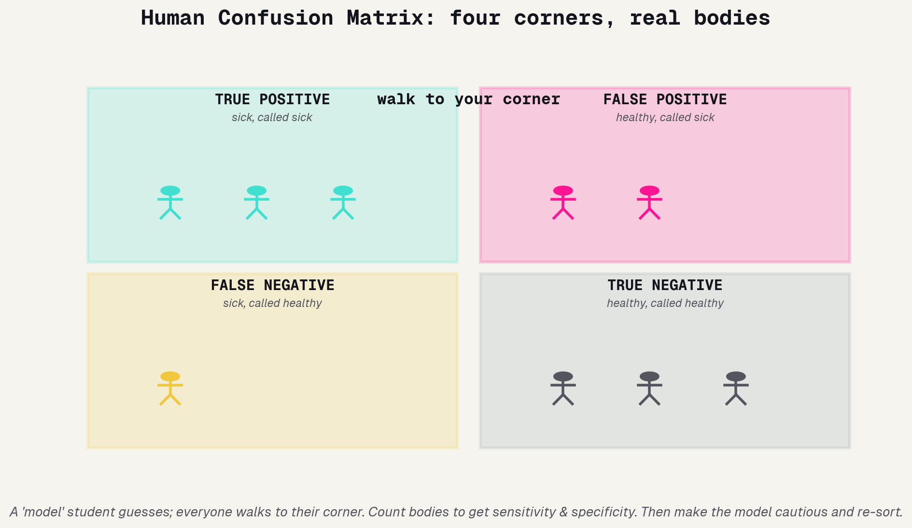

---

## Gradient-Descent Marble Run

**Day 1, when introducing training.** Materials: a marble and a curved surface, foam pipe insulation, bent cardboard, or a mixing bowl. Run it (5 min): roll the marble; it settles at the lowest point (least error). Now tilt the track steeper (a bigger learning rate) until the marble flies off the end. The reveal: learning is rolling downhill to less error, and the tilt is the learning rate, too small crawls, too big overshoots. Straight into the parameter playground.

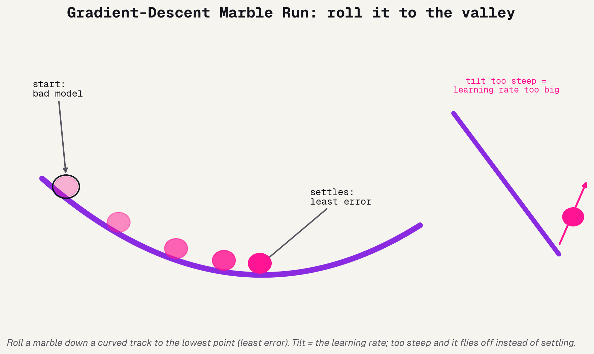

---

## Overfitting Showdown

**Day 1, when overfitting comes up.** Materials: ten printed eye cards with answers, plus a few unseen ones. Run it (8 min): Team A memorizes the exact answer to each of the ten; Team B agrees on a simple rule. Then quiz both teams on brand-new eyes. The reveal: the memorizers fall apart on new data. That is overfitting, felt rather than lectured, and why we always test on held-out data.

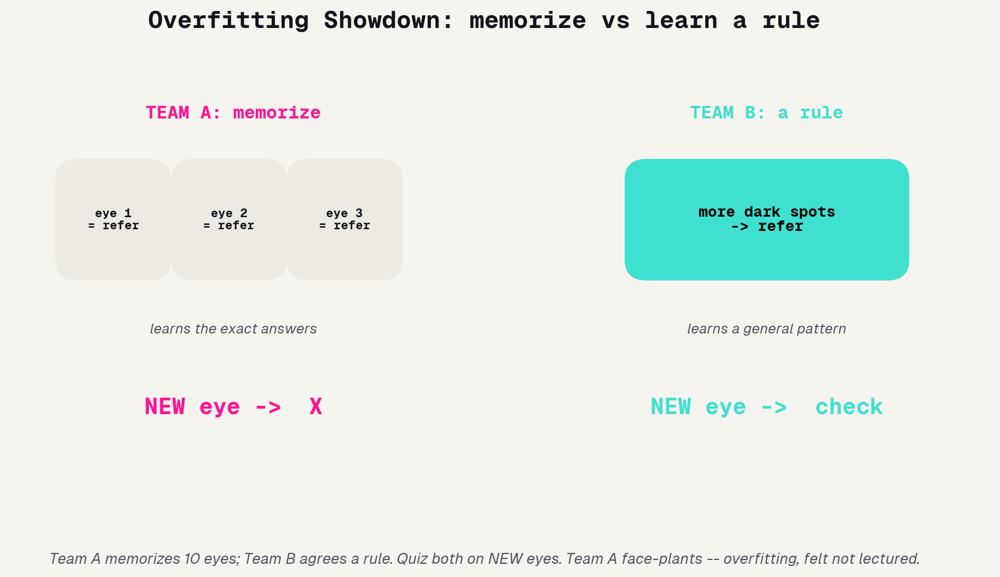

---

## Word-Piece Tiles

**Day 2, tokenization.** Materials: printed word and word-piece tiles (common words whole, rare words split like "en" + "larged"). Run it (6 min): teams chop a short radiology sentence into tiles, then cover the last tile and predict it. The reveal: that guess-the-next-tile game is literally what a language model does, over and over. Tokenization plus next-token prediction, in their hands.

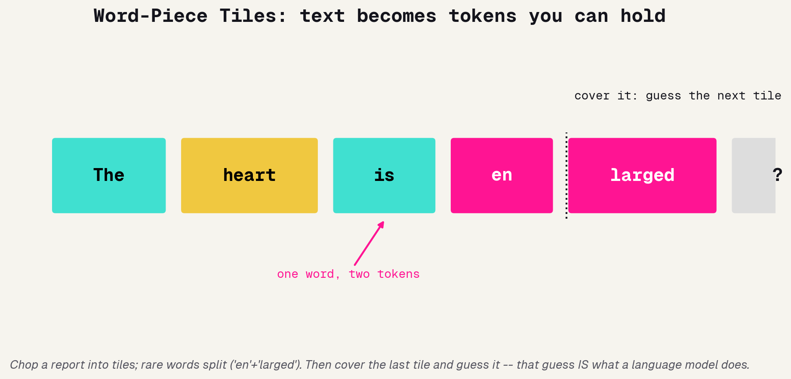

---

## The Hallucination Game

**Day 2, right after "what an LLM does".** Materials: none, just one volunteer as the confident narrator. Run it (3 min): ask increasingly obscure questions; the rule is they must always answer confidently and can never say "I don't know". The reveal: they start inventing fluent, confident nonsense, exactly what an LLM does when it does not know. Hence the rule of the day, use the model but verify it.

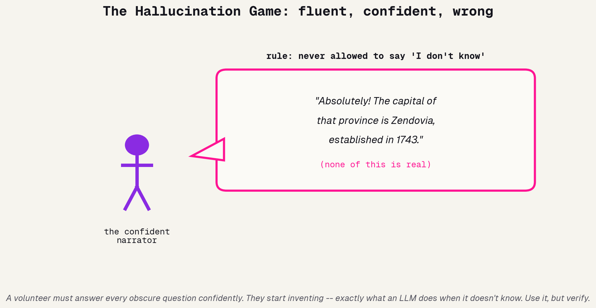

---

## Spot-the-Cheat (Leakage Race)

**Day 2, before the leakage reveal.** Materials: a printed feature table where one column is basically the answer. Run it (5 min): first pair to circle the column that is secretly the label, and explain why it is cheating, wins. The reveal: that is target leakage. A model using that column looks brilliant and has learned nothing, and catching it is the single most valuable skill of the day.

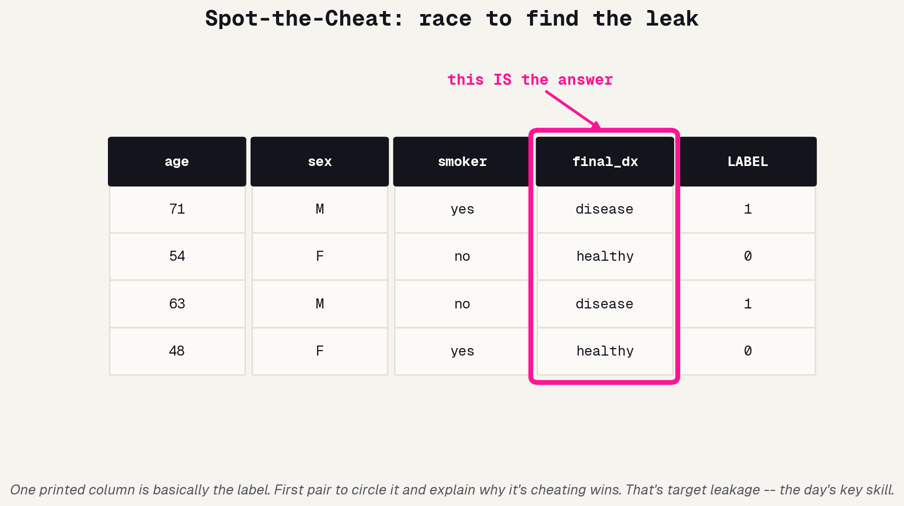

---

## Regulator Card-Sort

**Day 3, the "you're the regulator" exercise.** Materials: priority cards (Safety, Fairness, Transparency, Evidence, Privacy, Monitoring, Accountability), printable from `regulation_exercise.md`. Run it (8 min): in pairs, physically rank what a medical AI must prove before it touches a patient, then for each of the top three, write one concrete way to enforce it. The reveal: there is no answer key, real US, EU, and Asian regulators land differently, and the disagreement is the lesson.

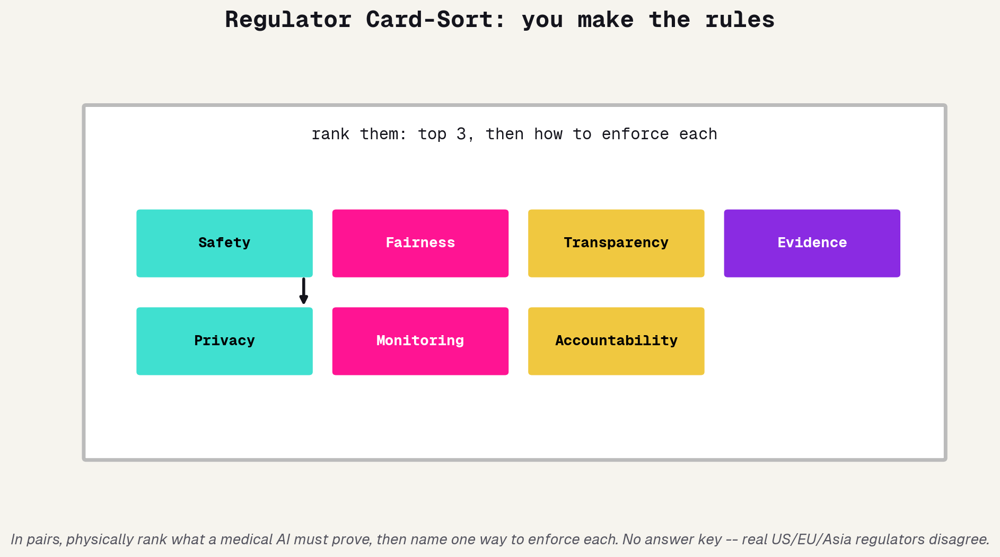

---

# Fitting it into the day

---

## When to reach for what

You will not run all of these; two or three per day is plenty. Mix to taste and to your room's energy. Day 1 has the most on offer, from the Feature Ladder to open, through the Marble Run and Overfitting Showdown, to the two live widgets in the evaluation block. Day 2 leans on the language activities, and Day 3 closes with the regulator sort before students choose their projects.

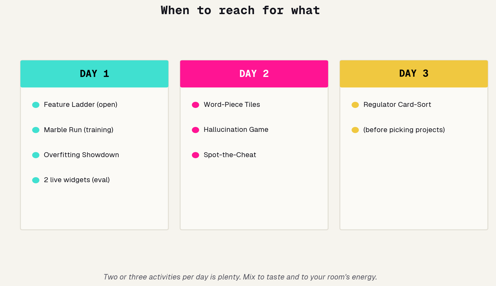
