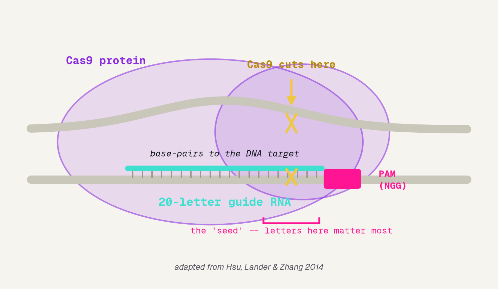
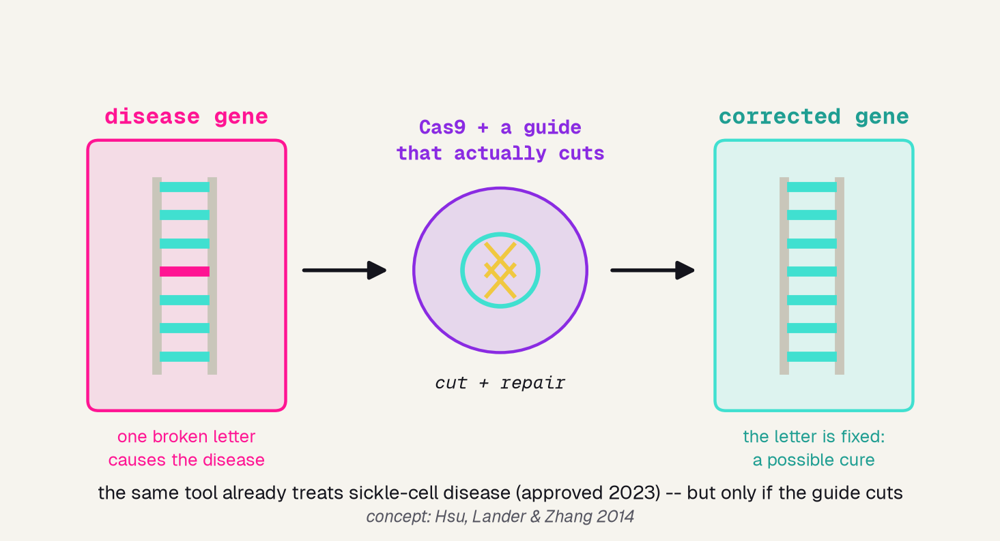
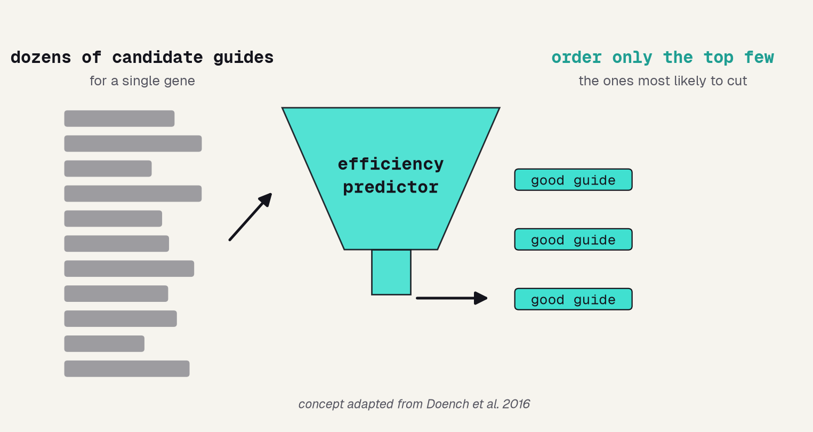
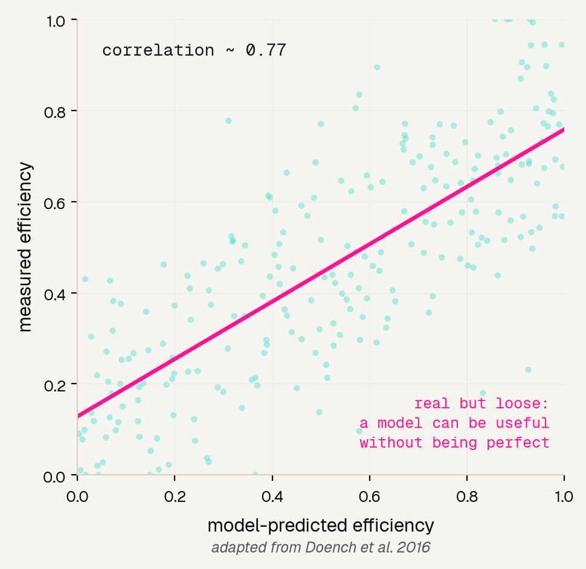
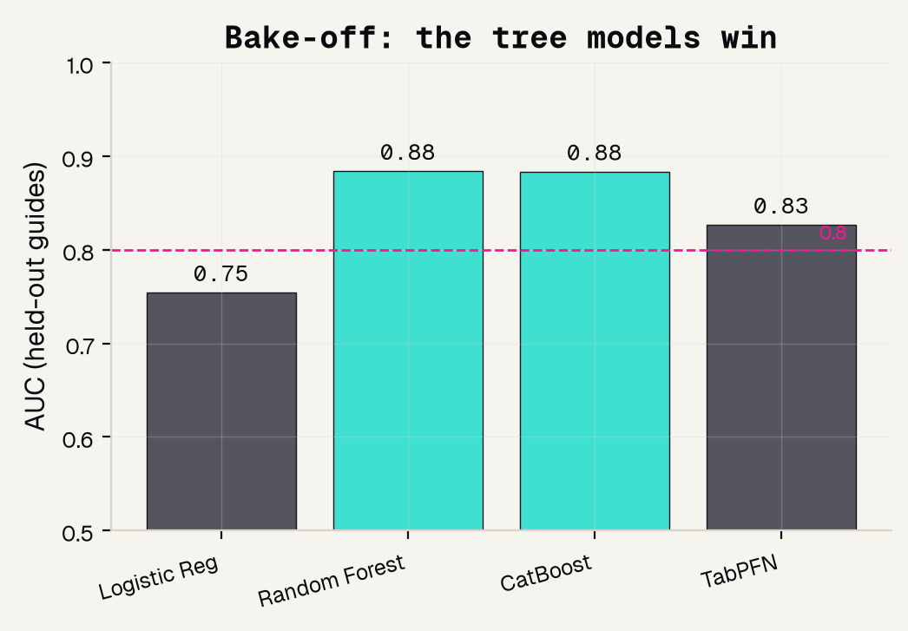
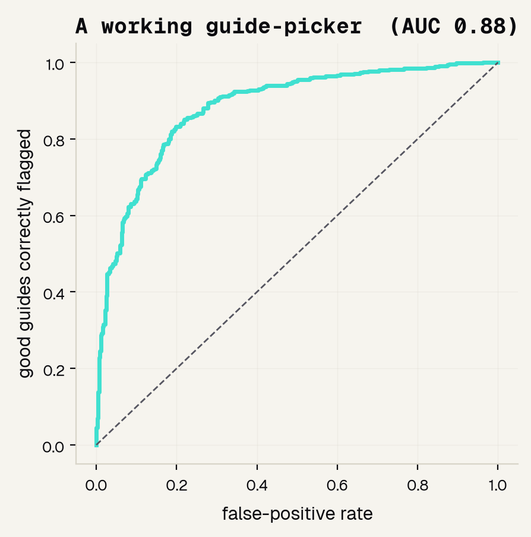
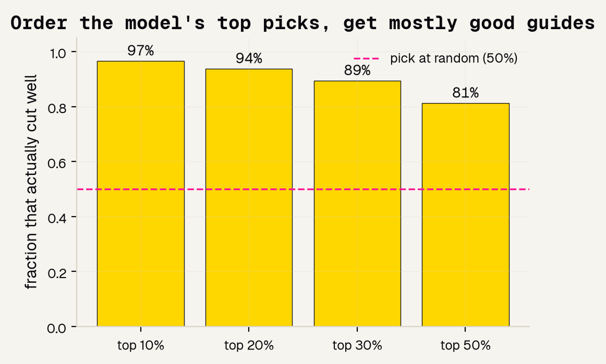
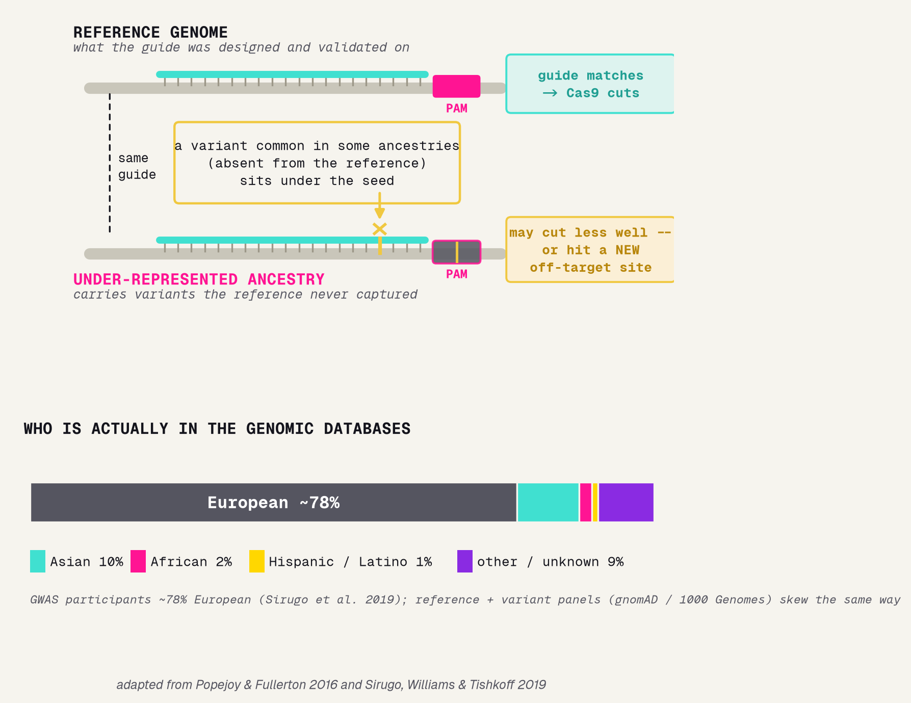

# Background

---

## Molecular scissors, aimed by 20 letters

CRISPR-Cas9 is a pair of molecular scissors you aim at one spot in DNA with a 20-letter guide. Where the guide matches, the Cas9 protein cuts -- and that cut is how we switch a gene off or repair it.

---

## CRISPR as therapy: fixing a broken gene

This is not hypothetical. The very same tool already treats sickle-cell disease. But a therapy only works if the guide actually cuts the target gene -- a dud guide fixes nothing.

---

## Not all 20 letters count equally

Cas9 grabs a landmark called the PAM, then reads the letters right next to it -- the "seed." Guides that mismatch there usually fail to cut, so the letters near the PAM should carry the most signal.

---

## The catch: most candidate guides are duds

For any gene there are dozens of possible guides, and many barely cut. Testing each one in the lab costs weeks. So we score them all first and order only the top few -- that is the tool we are building.

---

# The data

---

## Why Doench 2016

We need real, measured cut-scores, enough of them, from a source the field trusts. The Doench 2016 benchmark gives us all three.

### 5,310 guides
Each one actually tested in the lab, so every cut-score is a real measurement, not a simulation.

### 17 genes
A spread of targets, so the model learns sequence rules -- not the quirks of one gene.

### The benchmark
The dataset Doench's Rule Set 2 / Azimuth was built on -- what the whole field compares against.

---

## The benchmark that set the standard

Doench 2016 built "Rule Set 2" (Azimuth) on exactly these guides -- and even that landmark model's predictions scatter around the truth. That sets our honest expectation: capture the signal, do not expect perfection.

---

# The model

---

## First, turn letters into numbers

A computer cannot do math on the letter "A." one-hot flips four switches per position, keeping WHERE each letter sits; k-mer just counts letters and throws the order away. Since the seed is about position, one-hot wins.

---

## We tested four models -- we did not guess

Four models could learn this. We baked them off on held-out guides and let AUC decide. The two tree models tie at 0.88; both beat TabPFN and crush logistic regression.

---

## Model and data processing

The full recipe, so anyone could rebuild it: define the clean question, encode the letters, split honestly, train CatBoost, and grade on data it never saw.

---

# Results

---

## How we grade it: ROC and AUC

The picker outputs a score, not a yes/no. The ROC curve sweeps every cut-off; AUC is the area underneath, where 0.5 is a coin flip and 1.0 is perfect. Ours is 0.88.

---

## The win: order its top picks

AUC is abstract; here is the number a scientist feels. Rank guides by the model's score and order the top 10% -- 97% of them actually cut well, versus 50% if you picked at random.

---

## It rediscovered the biology

Feature importance asks which positions the model relied on. It peaks at position 20 -- right next to the PAM, the seed region -- matching decades of CRISPR science it was never told about.

---

## Fairness? There is nothing to audit -- honestly

Most medical-AI projects must check they work equally across patient groups. This one has none: the input is a DNA sequence -- no patient, no demographics, nothing to be unfair about. Saying so plainly beats forcing a fake analysis.

---

# The bottom line

---

## What it can and cannot do

A good project names its own limits out loud. Ours is a genuinely working guide-picker, but it is a demonstration -- and here is exactly where the line sits.

### It works
AUC 0.88 on the field's benchmark, and its top-10% shortlist is 97% good guides -- real lab time saved.

### It learned real biology
Importance peaks at the seed next to the PAM, matching decades of CRISPR science, so we can trust why it works.

### But it is a demo
It cannot match a production tool, handle cell-type effects, or say anything about off-target safety.

---

## Where equity lives in genome editing

Our data is guide sequences -- no patients -- so per-guide fairness does not apply. But genome editing does have a real equity problem, one step up: reference genomes and variant databases skew heavily European, so a guide validated on the reference can behave differently in people of under-represented ancestries.

### The mechanism
A variant that is common in some ancestries but rare in the reference can sit under the guide or the PAM -- creating a mismatch, an altered PAM, or a new off-target site. So the same guide may cut less well, or less safely, for those patients.

### The data that could check it
gnomAD and 1000 Genomes carry ancestry-labeled variant frequencies -- the raw material to flag guides that overlap ancestry-variable sites before anyone reaches the lab.

### Sources
[9] Popejoy and Fullerton 2016, Nature -- "Genomics is failing on diversity." [10] Sirugo, Williams and Tishkoff 2019, Cell -- "The Missing Diversity in Human Genetic Studies."

---

## References

The eight papers behind this project, from the landmark models to the plain-language reviews.

### Foundations and data
[1] Doench et al. 2016, Nat Biotechnol (Rule Set 2 + the data). [2] Doench et al. 2014, Nat Biotechnol. [3] Hsu, Lander and Zhang 2014, Cell. [4] Zheng et al. 2017, Sci Rep.

### Methods and reviews
[5] Chuai et al. 2018, Genome Biol (DeepCRISPR). [6] Kim et al. 2019, Sci Adv (DeepSpCas9). [7] Konstantakos et al. 2022, NAR. [8] Abbaszadeh and Shahlai 2025, arXiv.

### Equity and diversity in genomics
[9] Popejoy and Fullerton 2016, Nature 538:161-164. [10] Sirugo, Williams and Tishkoff 2019, Cell 177:26-31.

---

## The honest bottom line

A guide-picker earns its keep by shortlisting the winners and explaining itself. Use this to build intuition and narrow the field -- then use a validated tool and the lab to actually choose and confirm a guide.
