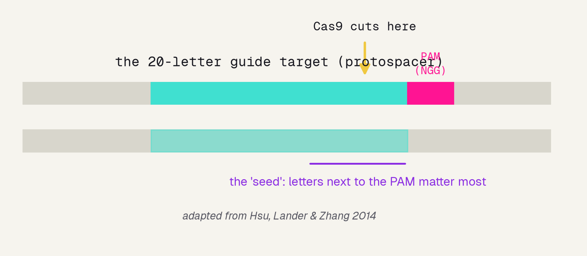
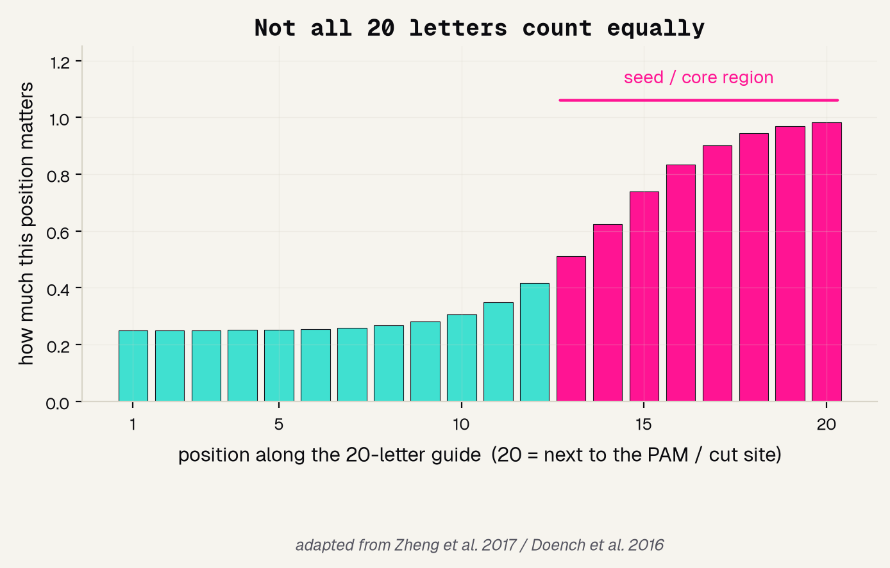
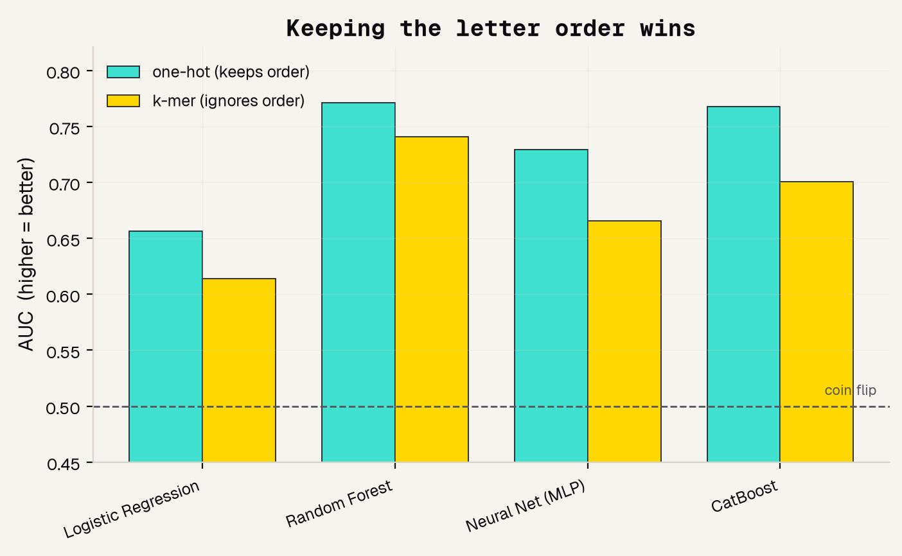
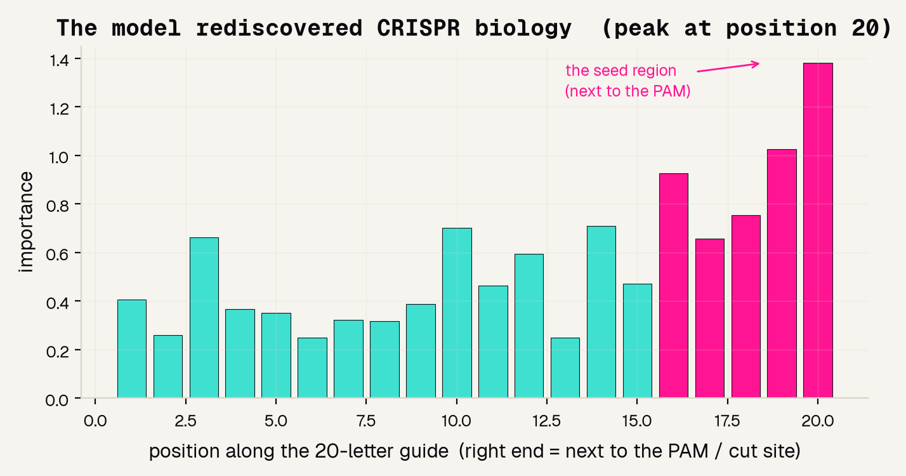
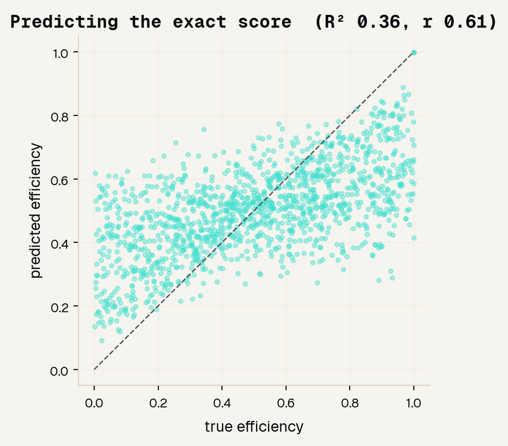

# Background

---

## What CRISPR actually is

CRISPR-Cas9 is a pair of molecular scissors that you aim at one exact spot in DNA using a short 20-letter guide (the letters are A, C, G, and T). Where the guide matches, the scissors cut, and that cut is how scientists turn a gene off or repair a mutation.

---

## How real scientists pick a guide

Here is the catch: two guides that look almost the same can behave completely differently, one cutting beautifully and the other barely at all. Testing every guide in the lab takes weeks, so scientists predict a guide's cutting efficiency from its 20 letters instead of measuring it.

### Score, do not eyeball
The best-known tool is Doench 2016's "Rule Set 2" / Azimuth, a model that scores a guide from its sequence [1], built on the earlier position-and-PAM rules of Rule Set 1 [2].

### The seed is king
Cas9 grabs a landmark called the PAM, then checks the handful of letters right next to it -- the "seed." Guides that mismatch there usually fail to cut [3][4].

### Neural nets push further
Newer tools like DeepCRISPR learn the same job with a neural network and more data, beating hand-built rules [5][6].

---

## The seed region matters most

Not all 20 letters count the same. The letters nearest the PAM -- the seed, roughly positions 13 to 20 -- carry far more of the signal about whether a guide will cut. Keep this picture in mind, because our own model is about to rediscover it on its own.

---

# Methods

---

## The question we are asking

We use the exact dataset behind the famous Rule Set 2 model [1]: real guides that scientists actually measured in the lab. Our job is to predict, from the 20 letters alone, whether a guide is a strong cutter. Notice the imbalance -- only about 1 in 5 guides is high-efficiency -- because it will change how we grade ourselves.

### 5,310 guides
Every one is a real 20-letter sequence with a measured cutting score from 0 to 1.

### 17 genes
The guides target 17 different human genes, so the model must learn sequence rules, not memorize one gene.

### 20% are "high"
Only about a fifth of guides cut well, so a lazy "always say low" guesser would look 80% accurate and be useless.

---

## Turning letters into numbers

A computer cannot do math on the letter "A," so we turn each guide into numbers -- and how we do that is the single most important choice in the whole project. We tried two ways and let the results decide.

### one-hot (keeps order)
Four on/off switches per position, so the model always knows which letter sits where. 20 positions times 4 = 80 numbers.

### k-mer (ignores order)
Just counts how many of each letter and letter-pair appear, throwing the position away. Only 21 numbers.

### LISTEN vs SILENT
Those two words share the same letters, so k-mer cannot tell them apart, but one-hot can. Since biology cares exactly where a letter sits (the seed!), one-hot should win.

---

# Results

---

## Keeping the letter order wins

We trained the same four models on each way of making numbers and compared them. Every single model did better with one-hot than with k-mer. The lesson is bigger than CRISPR: how you prepared the data mattered more than which fancy model you picked.

---

## Why we grade with AUC, not accuracy

Because only 20% of guides are high-efficiency, a model that blindly says "low" every time scores 80% accuracy while being completely useless. AUC ignores that cheap trick: it measures whether the model ranks good guides above bad ones, where 0.5 is a coin flip and 1.0 is perfect. Our best model reaches 0.77, real signal from sequence alone.

---

## The model rediscovered the seed

Now the payoff. We asked a simple, explainable model which positions along the guide it leaned on. Nobody told it about seeds -- yet its importance peaks at position 20, right next to the PAM, exactly the seed region that decades of CRISPR biology point to.

---

## Predicting the exact score

"High versus low" throws away detail, so we also tried to predict the exact 0-to-1 cutting score. R-squared tells us how much of the real ups-and-downs we explained: 0 is no better than guessing the average, 1.0 is perfect. We hit 0.36, a real but loose trend -- and that is honest, because the professional tools scatter the same way.

---

# Being honest

---

## What this toy model can and cannot do

A good project names its own limits out loud. Ours is a demonstration of an idea, not a design tool, and here is exactly where the line sits.

### It CAN
Show that a guide's sequence really does carry signal, and that the seed region matters, on the very same data the professionals use [1].

### It CANNOT match the pros
It will not beat a production tool, and it ignores cell-type and chromatin effects that change cutting inside a living cell [7].

### It CANNOT judge safety
It says nothing about off-target risk -- whether the guide also cuts the wrong places in the genome [8].

---

## References

The eight papers behind this project, from the plain-English CRISPR reviews to the models we compared ourselves against.

### Foundations
[1] Doench et al. 2016, Nat Biotechnol (Rule Set 2). [2] Doench et al. 2014, Nat Biotechnol (Rule Set 1). [3] Hsu, Lander and Zhang 2014, Cell. [4] Zheng et al. 2017, Sci Rep.

### Modern models and reviews
[5] Chuai et al. 2018, Genome Biol (DeepCRISPR). [6] Kim et al. 2019, Sci Adv (DeepSpCas9). [7] Konstantakos et al. 2022, NAR. [8] Abbaszadeh and Shahlai 2025, arXiv.

---

## The honest bottom line

A model you can explain, that agrees with known biology, is one people will trust. Use this to build intuition -- then use a validated tool and the lab to actually choose a guide.
