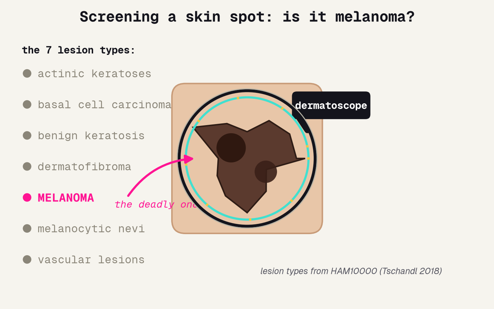
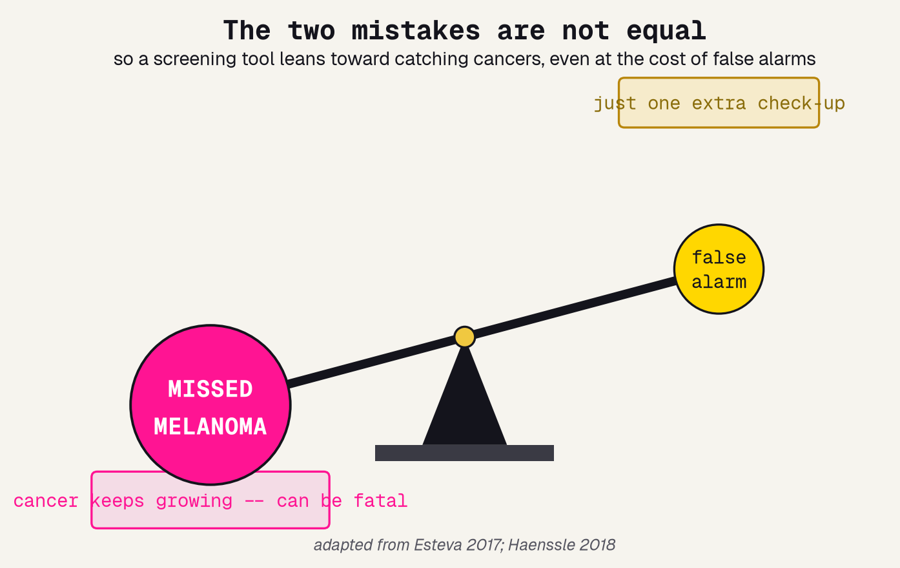
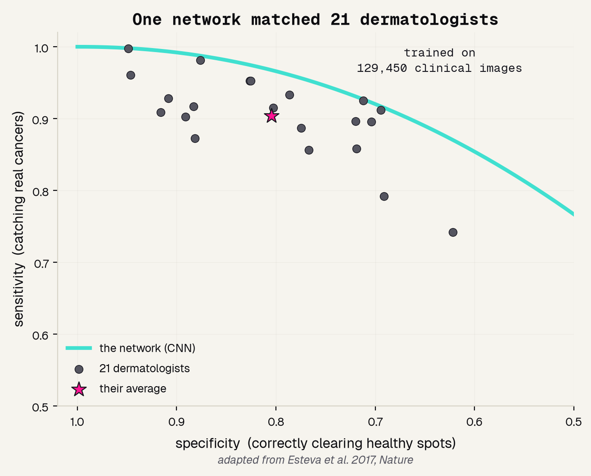
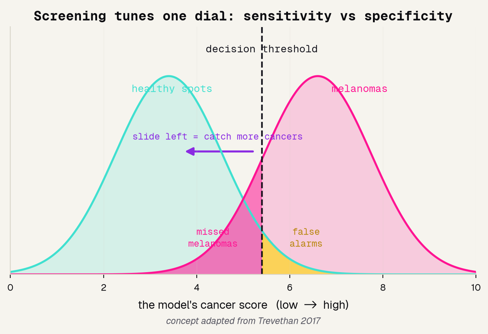
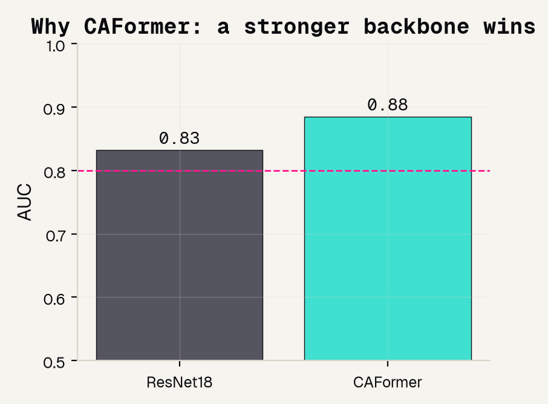
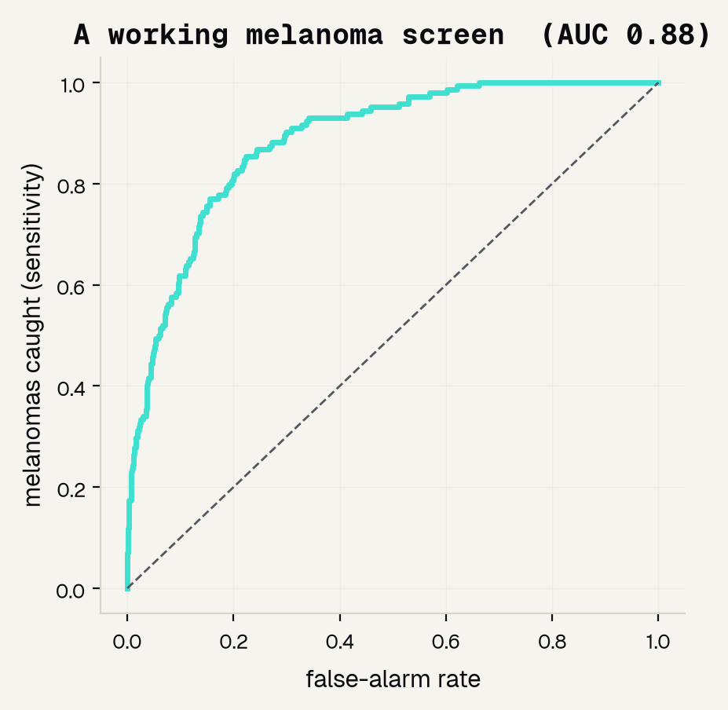
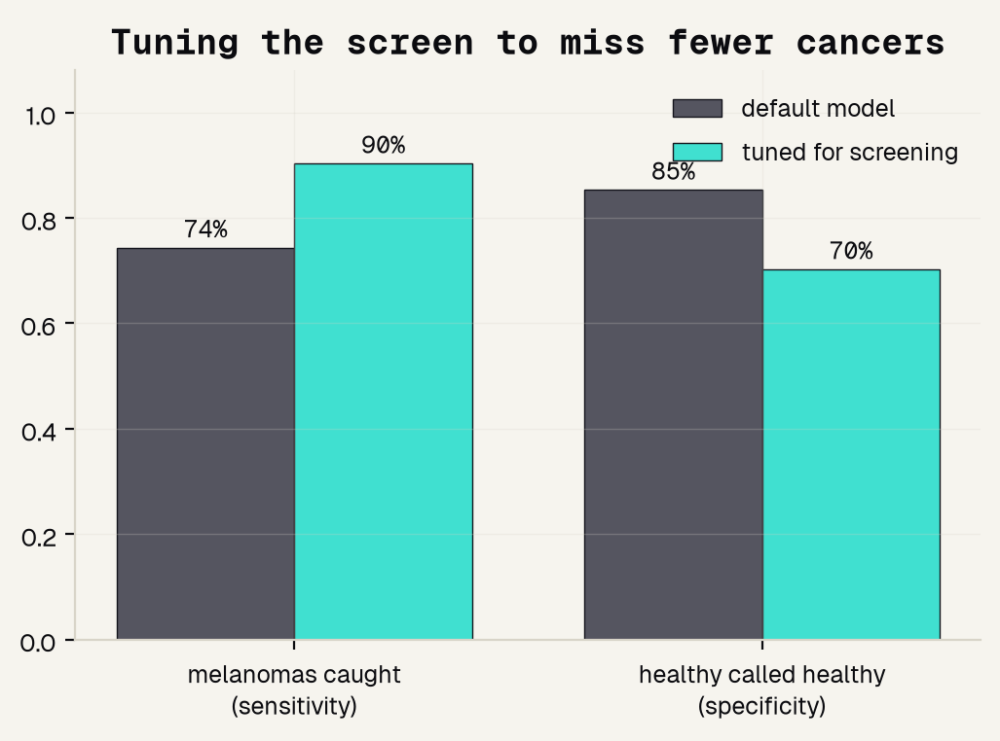
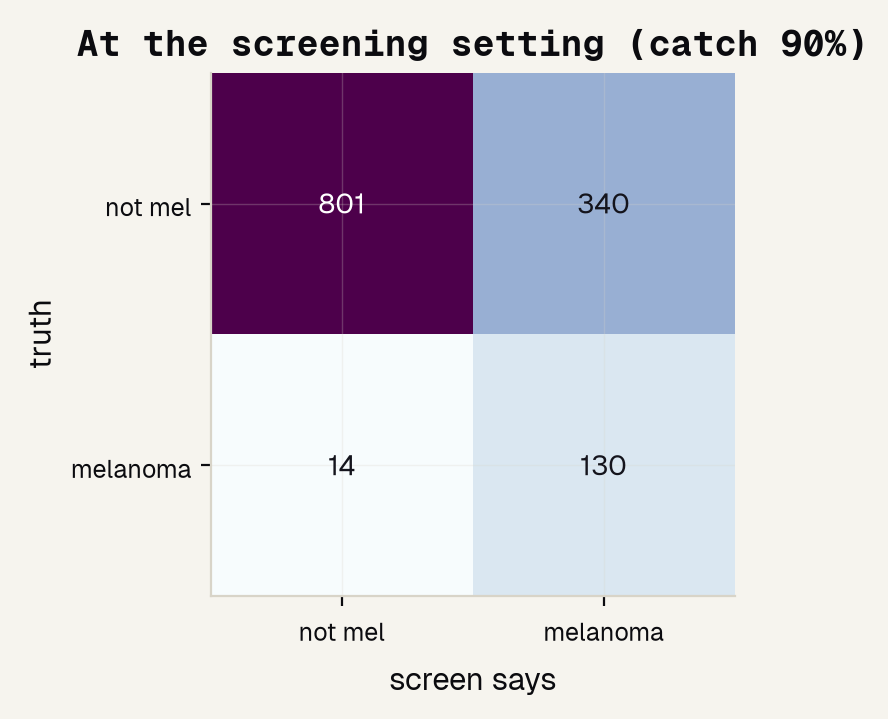
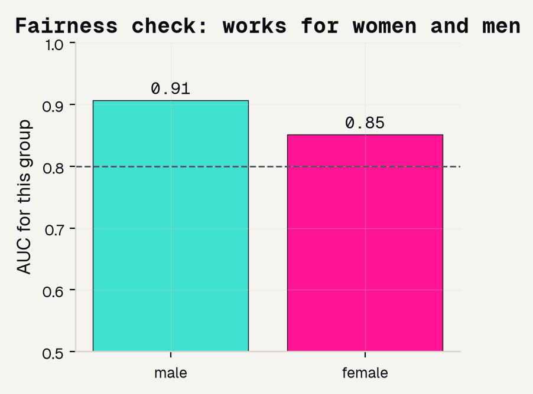
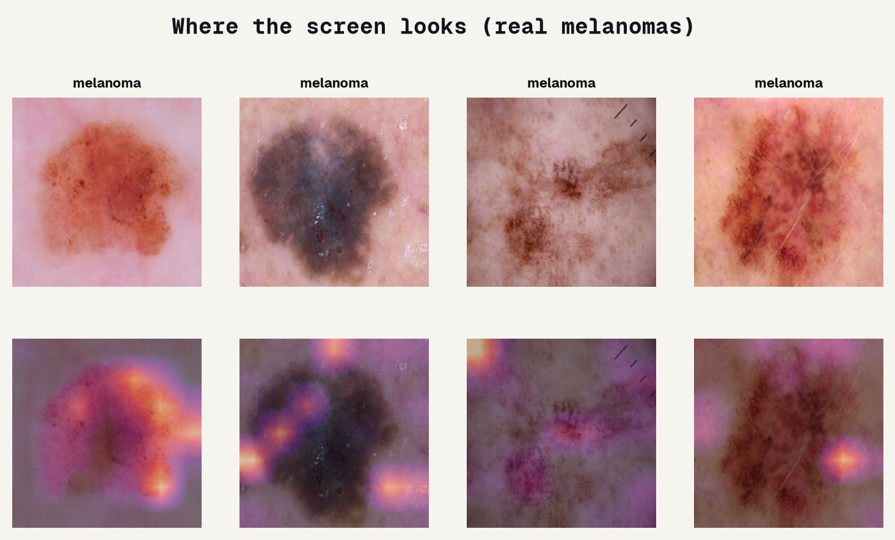

# Background

---

## The spot that could be melanoma

A dermatologist puts a dermatoscope over a skin spot and asks one question: is this harmless, or is it melanoma? HAM10000 holds real dermatoscopy photos of seven lesion types, and exactly one of them is the deadly one we must not miss.

---

## Why a miss is deadly

The two mistakes a screen can make are not equal. Waving a real melanoma through as harmless lets a cancer keep growing and can be fatal. A false alarm just costs one extra check-up. That asymmetry is the whole reason we build the tool the way we do.

---

## Machines already match dermatologists

This is not science fiction. In 2017 a single neural network, trained on about 129,450 clinical images, matched 21 board-certified dermatologists at telling dangerous skin cancers from harmless spots. Our project is a small, honest version of that same idea.

---

# The data

---

## Why HAM10000

We need real clinical images, enough of them to train on, and a record of who each patient is so we can check fairness. HAM10000 gives us all three, which is exactly why it is the right dataset for a first melanoma screen.

### 10,015 images
Real dermatoscopy photos, not cartoons -- the same kind a clinic captures.

### 7 lesion types
Collapsed to one screening question: melanoma versus everything else.

### 11% melanoma
The rare, deadly class -- and it records age and sex, so we can audit fairness.

---

## Accuracy is a trap; sensitivity is the job

Because only about 1 in 9 spots is melanoma, a lazy model that always says "not melanoma" scores nearly 89% accuracy and catches zero cancers. So we grade a screen on sensitivity, and we tune it with one dial: where we set the decision threshold.

---

# The model

---

## Borrow a brain: transfer learning

We only have about ten thousand skin images, far too few to teach a network from scratch. So we start from a network already trained on millions of everyday photos, reuse what it learned about edges and color, and fine-tune it on skin.

---

## Why CAFormer, not ResNet18

We did not guess which network to use -- we ran a bake-off and let held-out AUC decide. A plain ResNet18 was already good, but the stronger CAFormer backbone beat it, so CAFormer becomes our screen.

---

## Model and data processing

Here is the exact recipe, so anyone could reproduce it. A frozen CAFormer backbone with a fresh two-class head, fed full-resolution images, with the rare class up-weighted, graded only on data the model never saw.

---

# Results

---

## A working screen

How we measure a screen: the ROC curve sweeps every possible cut-off and plots melanomas caught against false alarms, and AUC is the area underneath, where 0.5 is a coin flip and 1.0 is perfect. Our screen scores 0.885.

---

## Tuning to miss fewer cancers

The default cut-off is tuned for accuracy, not for catching cancers. So we lower the threshold on purpose: catch more melanomas, and accept the cost in false alarms. This is the fix that matters for a screen.

---

## At the screening setting

Measured by the confusion matrix, the tuned screen catches 130 of 144 melanomas and misses only 14, at the price of 340 false alarms out of about 1,140 healthy spots. Those are the exact trade-offs a clinician would weigh.

---

## Does it work for women and men?

Measured by AUC computed separately for each sex, the screen clears 0.8 for both groups, but it is stronger for men than for women. Naming that gap out loud is part of building a screen you can trust.

---

## Where the screen looks

Feature importance for an image is Grad-CAM: it highlights where on the photo the model looked. The bright areas sit on the pigmented lesion itself, the same cues a dermatologist uses -- not a hair, a ruler, or the corner of the frame.

---

# Being honest

---

## What it can and cannot do

A good project names its own limits out loud. Ours is a genuinely working screen, but it is not ready for a patient, and here is exactly where the line sits.

### It works
A real melanoma screen on real dermatoscopy: AUC 0.885, tuned to catch 90% of melanomas.

### But it is uneven
A real gap by sex, and HAM10000 skews toward lighter skin, so darker skin is unproven here.

### A real tool
Would train on more diverse patients, be validated across many hospitals, and keep a dermatologist in the loop.

---

## References

The seven papers behind this project, from the landmark studies to the plain-language primers on what sensitivity really means.

### Foundations
[1] Esteva et al. 2017, Nature. [2] Tschandl, Rosendahl and Kittler 2018, Sci Data (HAM10000). [3] Haenssle et al. 2018, Ann Oncol. [4] Tschandl et al. 2019, Lancet Oncol.

### Methods and primers
[5] Kim et al. 2022, BMC Med Imaging (transfer learning). [6] Trevethan 2017, Front Public Health (sensitivity). [7] Wei et al. 2024, Front Med (AI and skin cancer).

---

## The honest bottom line

A screen earns trust by catching the dangerous case, tuning its threshold on purpose, and checking who it works for. Use this to learn the screening mindset -- then use a validated tool and a dermatologist to actually screen a patient.
