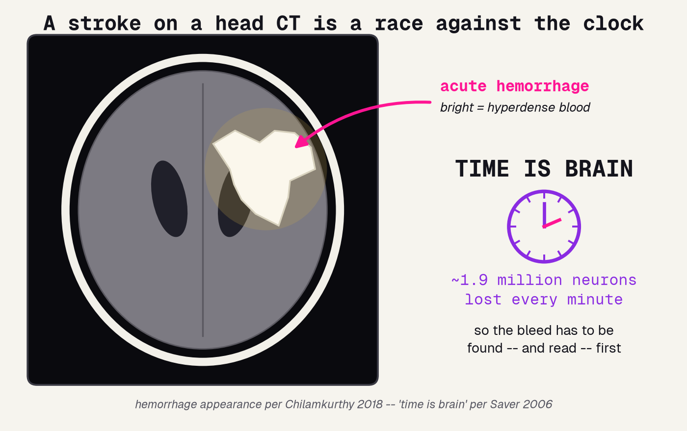
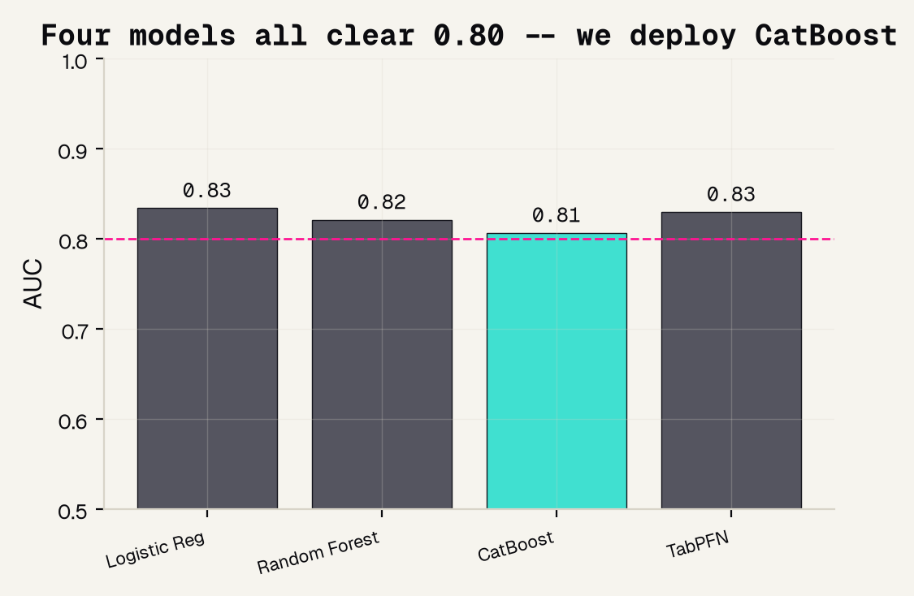
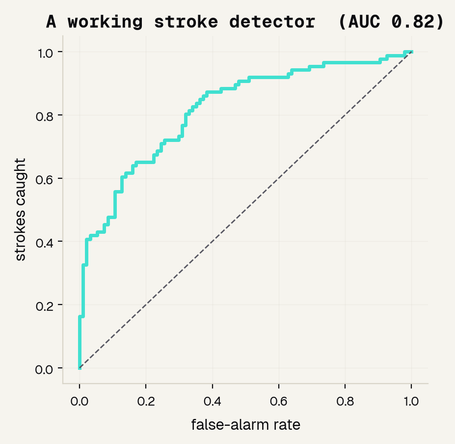
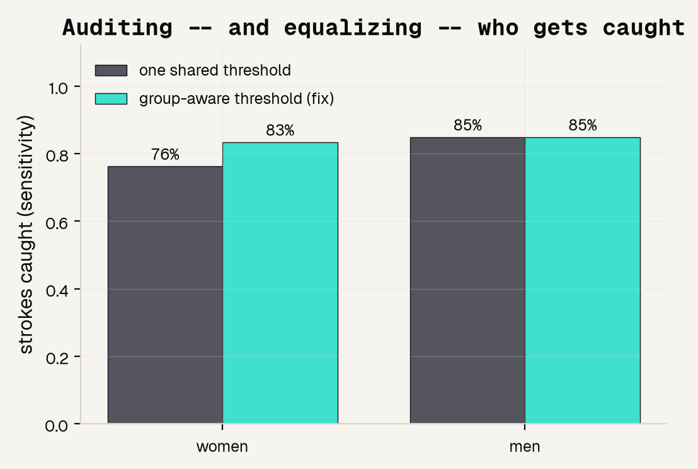
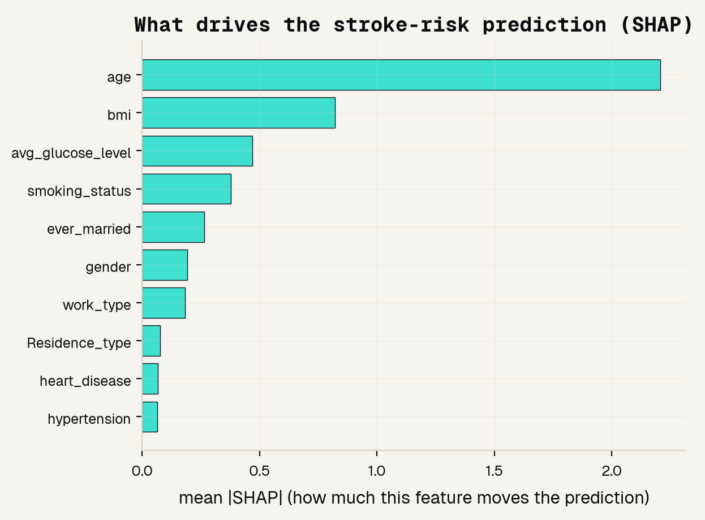

# Background

---

## A stroke is a race against the clock

In the ER a bleed on a head CT is an emergency: in a large stroke roughly 1.9 million neurons die every minute until it is treated. The bleed shows up bright -- hyperdense -- so the whole job is to find it fast and read it first.

---

## Triage AI reads the dangerous scans first

The most real, already-deployed use of medical AI here is triage: a network scans the whole stack and pushes the scans that probably show bleeding to the top of the radiologist's list, so the dangerous ones get read first instead of in arrival order. Real tools do this with AUCs above 0.90 and cut time-to-treatment.

---

## The catch: a dataset can hide who is in it

You can build a model that works on average and still have no way to check who it fails. To audit fairness you compare accuracy across groups -- and that only works if the dataset records who each scan came from. That single idea is the spine of this whole project.

### Works on average
A detector can hit a strong AUC and still be much worse for one group of patients.

### But un-checkable
If age, sex, race, and scanner are never recorded, there is nothing to group by -- the audit cannot run.

---

# The data

---

## Two datasets, documented very differently

We use two datasets on purpose, because their contrast is the lesson. One is images with no patient facts; the other is a table that records sex, age, and health history. Only the second can be audited for fairness.

### Brain CT -- normal vs. stroke
Real scans, one label each. No age, sex, race, or scanner. You can train on it -- but you cannot audit who it fails.

### Tabular stroke -- 5,109 patients
One row per patient, and it records sex, age, hypertension, glucose, smoking. The demographics that make an audit possible.

---

## What a datasheet should record

The Datasheets for Datasets idea says every dataset should ship a standard record of who is in it, so users know its limits before trusting a model built on it. Our brain-CT set answers only two of the six questions a datasheet asks.

---

# The model

---

## Borrow a brain: transfer learning for the scans

We do not have millions of scans, so we start from a network already trained on millions of everyday photos, keep what it learned about edges and texture, and train only a small new head for normal vs. stroke. We use a strong modern backbone, CAFormer, at full 224-pixel resolution.

---

## The CT recipe, so it is reproducible

Every step matters, and any one done wrong quietly breaks the result. Here is the whole pipeline in one place, from the frozen backbone to the held-out test set every number is reported on.

---

## For the table: we ran a bake-off

We did not guess the tabular model -- we tried four and compared AUC on held-out patients. All four cleared the 0.80 bar, so the honest choice is not the top decimal. We deploy CatBoost because it is a tree we can explain with SHAP and audit by sex.

---

# Results

---

## The CT detector works

How we grade it: the ROC curve sweeps every cut-off and plots strokes caught against false alarms, and AUC is the area underneath, where 0.5 is a coin flip and 1.0 is perfect. Our detector scores 0.817 -- a genuinely working detector.

---

## Read the two errors apart

One accuracy number would hide the split, so we read the confusion matrix. At its operating point the detector catches about two-thirds of real strokes and correctly clears 81% of normal scans. For a safety-net triage tool you would tune it to catch more strokes, accepting more false alarms.

---

## Is it reading the brain, or cheating off the skull?

A model can be right for the wrong reason. Grad-CAM paints where the network looked. Some heat lands on brain tissue, but some drifts to the skull edge and the image border -- a classic shortcut that works here and would break on a new scanner.

---

## The wall: the audit we cannot run

We can check accuracy by class, because the label exists. But the audit that matters -- does it work as well for older patients as younger, women as men, one scanner as another -- we cannot run at all. The dataset never recorded those fields, so there is nothing to group by.

---

## Now a dataset that records sex: audit, then fix

Because the stroke table records sex, we can do the exact audit the scans made impossible. At a threshold tuned to catch 80% of strokes overall, women's strokes are caught less often than men's -- a real gap. A group-aware threshold closes it.

---

## What drives the risk score: age dominates

For a table, feature importance is SHAP -- how much each column moves the prediction. Age dominates, with BMI and glucose next; sex barely moves the score even though it mattered for the fairness audit. A model you can read is one you can question.

---

# The takeaway

---

## Recording demographics makes fairness auditable -- and fixable

Two datasets, one clean lesson. The imaging set hides who is in it, so the most important audit is impossible. The tabular set records sex, so a real gap became visible and closable.

### CT: works, can't audit
AUC 0.817, but no demographics -- the who-does-it-fail audit simply cannot be run.

### Tabular: works, audited, fixed
AUC 0.81; women's strokes caught 76% to 83%, closing the gap with a group-aware threshold.

### The rule
A model that runs is easy. A model you can audit is the real bar -- and metadata is what makes it possible.

---

## References

The head-CT triage work, the datasheets idea, and the fairness audits this project is built on.

### Head-CT triage AI
[1] Chilamkurthy 2018 (The Lancet); [2] Flanders 2020 (Radiology: AI, RSNA challenge); [3] Seyam 2022 (Radiology: AI).

### Datasets and documentation
[4] Gebru 2021 (Comms of the ACM, Datasheets); [5] Tripathi 2023 (J Am Coll Radiol); [8] Kim 2022 (transfer learning).

### Fairness audits that need metadata
[6] Seyyed-Kalantari 2021 (Nature Medicine); [7] Yang 2024 (Nature Medicine); Saver 2006 (Stroke, "Time Is Brain").

---

## The honest bottom line

An imaging dataset can hide who is in it. Recording demographics is what turns fairness from a hope into something you can measure -- and fix. That is the finding, not the footnote.
