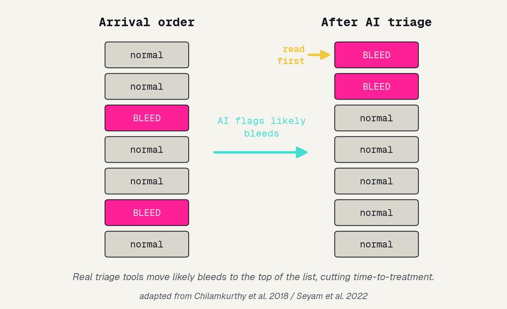
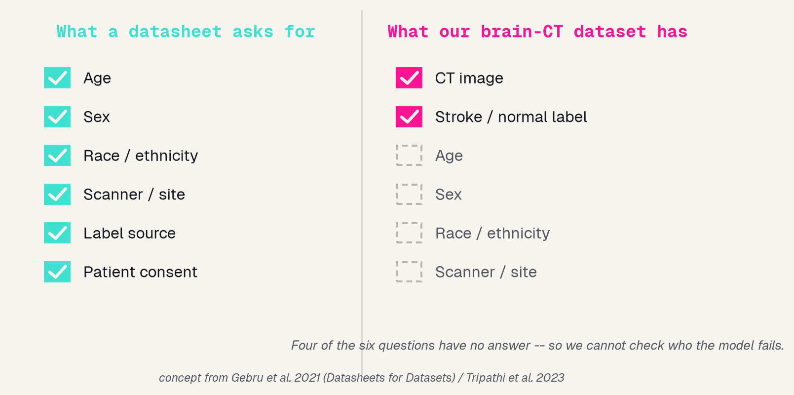
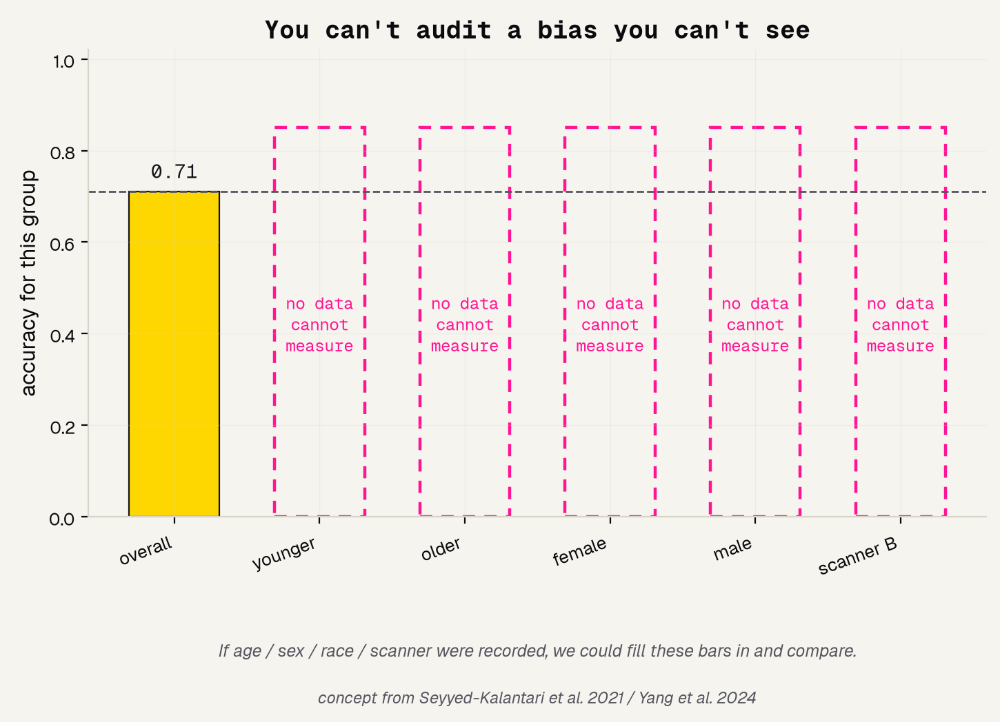
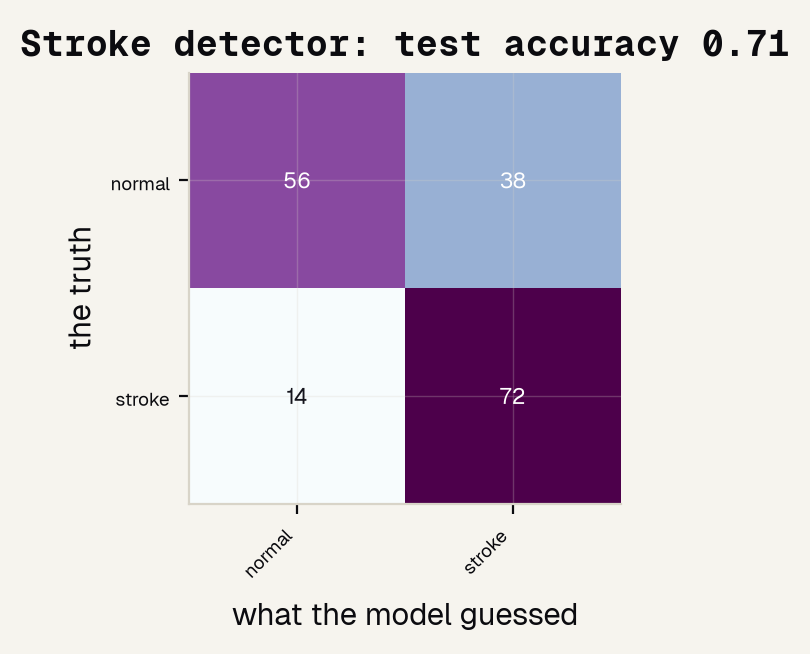
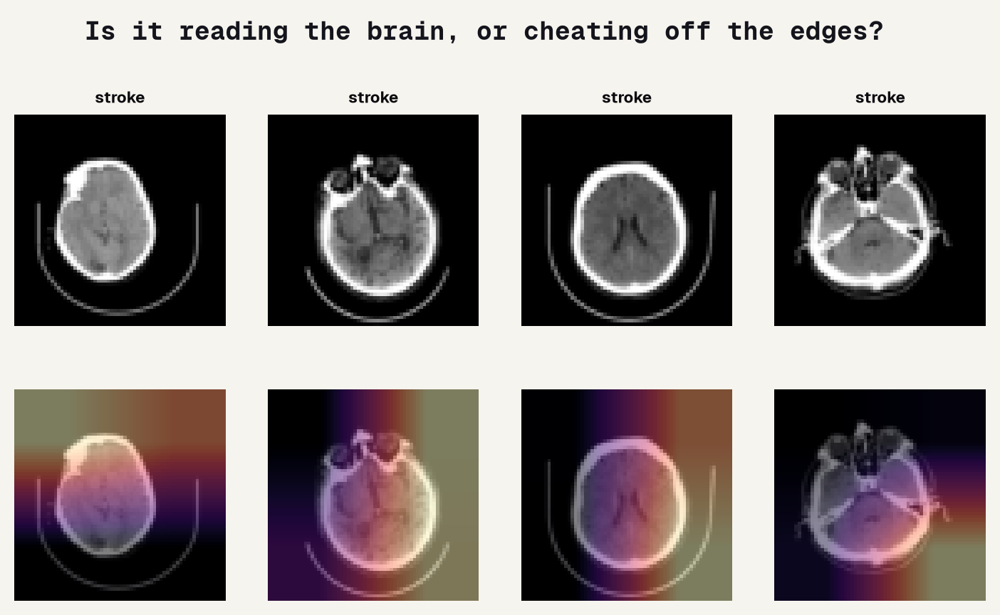
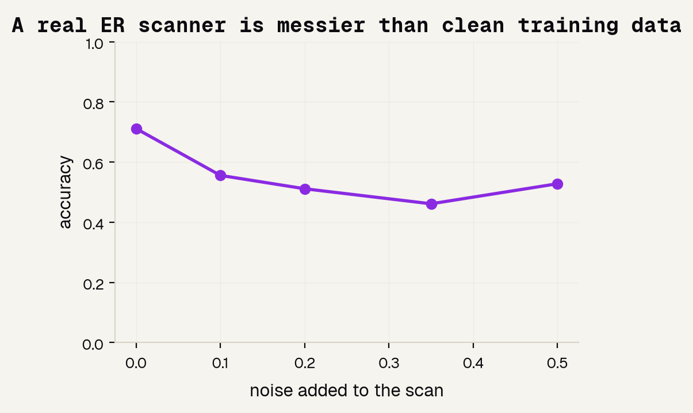
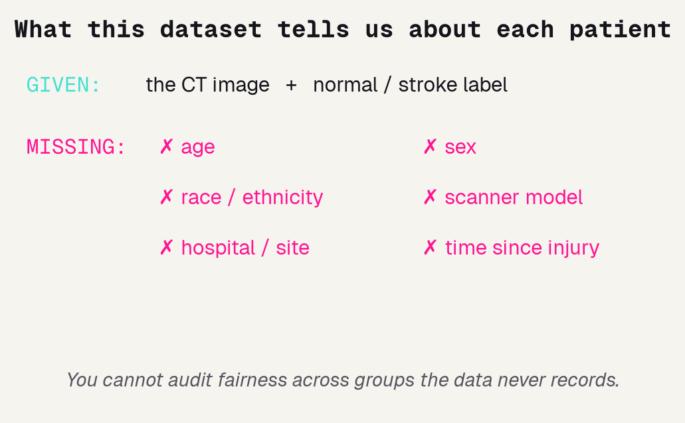

# Background

---

## Head-CT triage AI, in one picture

In the ER, a bleed on a brain CT is an emergency and minutes matter. The most real, already-deployed use of medical AI here is triage: scan the whole stack, and push the scans that probably show bleeding to the top of the radiologist's list so the dangerous ones get read first.

---

## A dataset should tell you who is in it

To know whether a tool is fair, you compare accuracy across groups: young vs. old, women vs. men, scanners, sites. That only works if the dataset records who each scan came from. The Datasheets for Datasets idea says every dataset should ship that documentation, and reviews show radiology datasets often do not. Our brain-CT set has only the image and a label.

---

## You can't audit a bias you can't see

Real audits found imaging AI that quietly missed disease more often in female, Black, and low-income patients, and AI that leans on demographic shortcuts. You can only see those failures if the dataset records the groups. When it doesn't, every per-group bar is a blank you cannot fill.

---

# Methods

---

## The task and the data

A clean binary question, and a deliberately bare dataset. Each example is a 64-by-64 brain CT slice with one label: normal or stroke. That is all. There is no age, sex, race, scanner, site, or time-since-injury. Remember that missing column; it becomes the whole finding.

### Task
Classify one brain CT slice as normal or stroke.

### Given
The CT image, and a normal / stroke label.

### Missing
Age, sex, race, scanner, site — every field a fairness audit needs.

---

## The idea: reuse a pretrained network

The same trick that won Day 1. Rather than teach a network to see from zero on a few hundred scans, we take a ResNet18 already trained on a million everyday photos, freeze what it learned about edges and texture, and train only a small new head to map those features to normal vs. stroke. Borrowed knowledge beats from-scratch when data is small.

---

# Results

---

## It catches most strokes — but cries wolf

On the held-out test set, the detector reaches about 71% accuracy. But accuracy is the wrong lens for screening. Sensitivity is about 0.84: of the real strokes, it catches most, which is the error we most want to avoid. Specificity is only about 0.60: it false-alarms on many normal scans. One accuracy number would have hidden that split.

---

## Is it reading the brain, or cheating off the skull?

A model can be right for the wrong reason. Grad-CAM paints where the network looked. Some heat lands on brain tissue, but some drifts to the skull edge and the image border, a classic shortcut that works on this dataset and would break on a new scanner. Worth saying out loud, not hiding.

---

## Does it survive a messier scan?

Training images are clean; a real ER scanner is noisier. We add increasing random noise to the test images and watch accuracy. It sags fast, so this toy model is brittle. A deployable tool would need augmentation, far more data, and live monitoring after it ships.

---

# The gap that IS the finding

---

## The audit we literally cannot run

We can audit fairness by class, because the label exists. But the audit that matters, does it work as well for older patients as younger, women as men, one scanner as another, we cannot run at all. Not because it is hard, but because the dataset never recorded age, sex, race, or scanner. There is nothing to group by.

---

## Why that silence is disqualifying

Our detector might be much worse for some group of patients, and we would have no way to know. Datasheets work and radiology-AI reviews say a dataset should document who is in it; real audits show hidden bias appears exactly along age, sex, race, and scanner lines, and only where those labels exist. For a tool that would touch patients, an un-runnable fairness audit is not a footnote. It is the headline.

---

# References

---

## References

The head-CT triage work, the datasheets idea, and the fairness audits this project is built on.

### Head-CT triage AI
Chilamkurthy 2018 (The Lancet); Flanders 2020 (Radiology: AI, RSNA challenge); Seyam 2022 (Radiology: AI).

### Datasets and documentation
Gebru 2021 (Communications of the ACM, Datasheets); Tripathi 2023 (J Am Coll Radiol).

### Fairness audits that need metadata
Seyyed-Kalantari 2021 (Nature Medicine); Yang 2024 (Nature Medicine).
