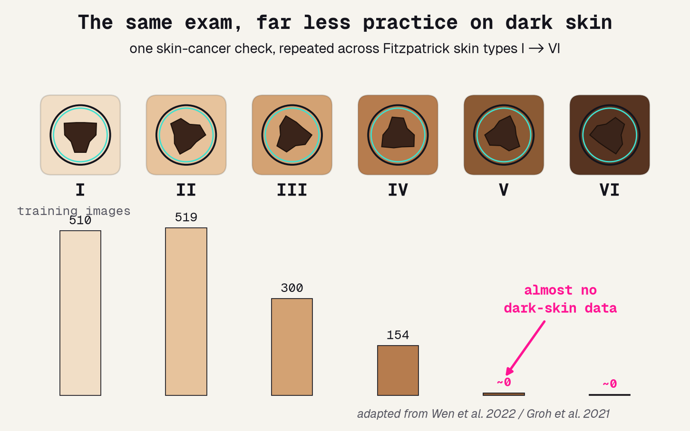
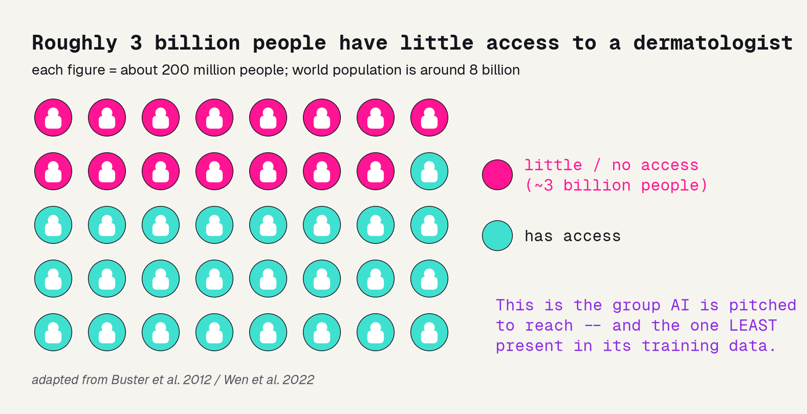
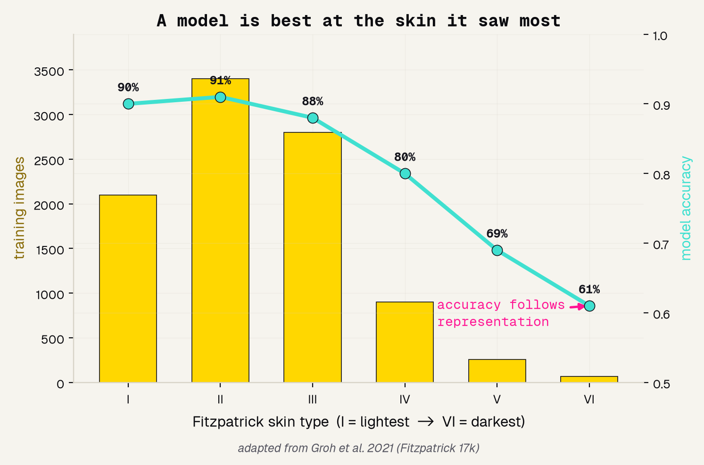
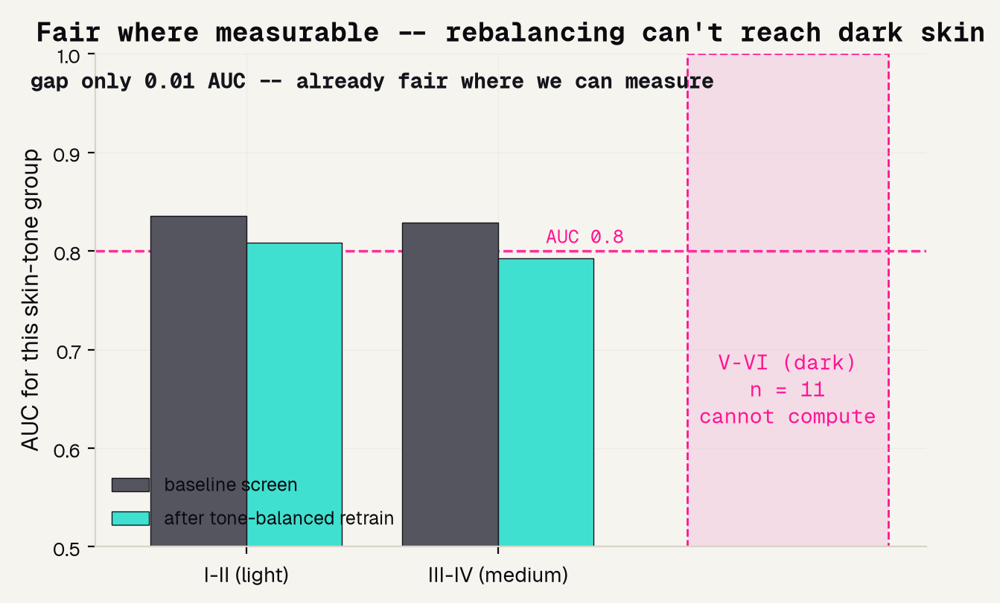
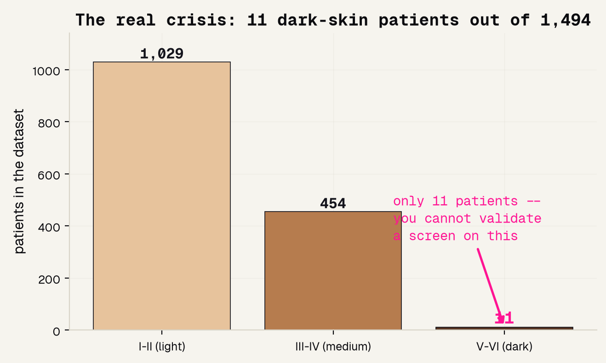
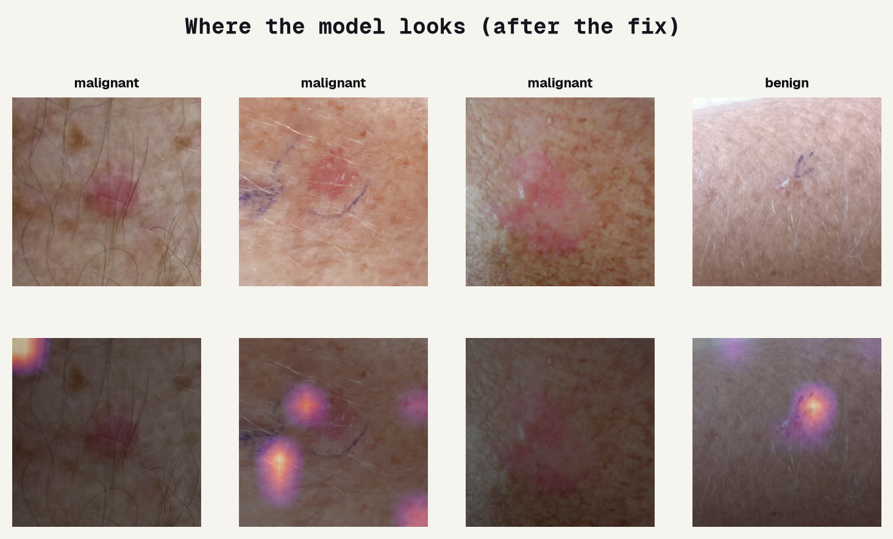

# Background

---

## The same lesion, six different skins

A dermatologist puts a dermatoscope over a skin spot and asks one question: is this cancer? Now ask it across the Fitzpatrick skin-type scale, from the lightest skin to the darkest. The exam is the same. What is not the same is how much any AI ever got to practice on each tone -- tall on the light end, almost nothing on the dark end.

---

## Who can even reach a dermatologist?

Skin-cancer AI is pitched as a way to reach the roughly three billion people with little access to a dermatologist. That promise is real. So is the quiet irony: the people the tool is meant to help most are the ones least present in the data it learns from.

---

## A model is best at the skin it saw most

This is not a hunch. Groh built the Fitzpatrick 17k dataset and showed a model is most accurate on the skin types it saw most during training; Daneshjou tested top models on a diverse, biopsy-confirmed set and watched accuracy drop sharply on dark skin. Accuracy follows representation.

---

# The data

---

## Why PAD-UFES-20

To check whether a model is fair by skin tone, the data has to record skin tone -- and almost none do. PAD-UFES-20 is the rare exception: real clinical skin images from Brazil that write down each patient's Fitzpatrick skin type. That single column is what turns "we worry about bias" into "we can measure it."

### 1,494 patients
Real clinical skin photos, biopsy-labeled malignant or benign.

### records skin tone
The Fitzpatrick skin type of every patient -- rare, and the whole reason this audit is possible.

### split by patient
Train and test never share a patient, so the score is honest.

---

## You can only audit what you record

Here is the difference that decides everything. A tone-blind dataset can hide a skin-tone gap no matter how hard you look -- the information simply is not there. A dataset that records skin tone lets you split the score apart and see who the model works for. Same model, but only one of them can be held accountable.

---

# The model

---

## Borrow a brain, then split by patient

We do not have millions of skin images, so we start from a network already trained on millions of everyday photos and fine-tune it on skin. Then we split by patient, so the same person's lesions never sit in both train and test, and grade only on patients the model never saw.

---

## Model and data processing

Here is the exact recipe, so anyone could rebuild it. A pretrained CAFormer fine-tuned to a two-class head, fed full-resolution normalized images, framed as malignant versus benign, graded on a patient-level split, and audited along the recorded skin tone.

---

# Results

---

## A working screen

The audit only means something if the screen actually works -- auditing a broken model tells you nothing. Measured by AUC on held-out patients, where 0.5 is a coin flip and 1.0 is perfect, our screen scores 0.83. That is a genuinely working screen, and now we can ask the harder question.

---

## Fair across the tones we can measure

Because the data records skin tone, this is a real measurement, not a guess. Across light and medium skin the screen is already roughly fair -- the AUC gap is only about 0.01. And a tone-balanced retrain did not shrink it, because for dark skin there is nothing to rebalance.

---

## The real crisis: 11 patients

Here is the number the average hides. Out of 1,494 patients, only 11 have dark skin. You cannot validate a screen for a whole group from 11 people, no matter how good the average looks. The under-representation is not a footnote -- it is the finding.

---

## Where the model looks

Feature importance for an image is Grad-CAM: it highlights where on the photo the model looked. The bright areas sit on the lesion itself, the cues a clinician reads. But Grad-CAM can only tell us the model looks in the right place -- it cannot tell us it works on skin it never trained on.

---

# Being honest

---

## What this project shows

A good project names exactly what it can and cannot claim. Ours is a working, auditable screen -- and its most important result is an honest statement about who is missing from the data.

### It works, and we could audit it
AUC 0.83, and because the data records skin tone we could actually measure fairness -- which most skin datasets make impossible.

### The real gap is who is missing
Only 11 dark-skin patients -- too few to validate. And no race or country is recorded, so those gaps stay invisible here.

### The fix is data, not a trick
Rebalancing cannot invent dark-skin patients. Fixing dark-skin performance means collecting representative data -- exactly what DDI and Fitzpatrick 17k set out to do.

---

## References

The equity lens on dermatology AI rests on a specific body of work, from the scale that names the skin-tone groups to the studies that measured the gaps and the case that showed a fair-looking number can still be unfair.

### Foundations and gaps
[1] Fitzpatrick 1988, Arch Dermatol -- the skin-type scale. [2] Groh et al. 2021, CVPR Workshops -- Fitzpatrick 17k. [3] Daneshjou et al. 2022, Sci Adv -- DDI, models drop on dark skin. [4] Obermeyer et al. 2019, Science -- a fair-looking algorithm that underserved Black patients.

### Data and access
[5] Wen et al. 2022, Lancet Digital Health -- most public skin images are light skin. [6] Adamson and Smith 2018, JAMA Dermatology -- AI can widen care gaps. [7] Buster, Stevens and Elmets 2012, Dermatologic Clinics -- disparities and access.

---

## The honest bottom line

A model can only be fair to the people the data remembers. This one screens well, and we could audit it only because the data recorded skin tone -- but 11 dark-skin patients is a gap no algorithm can close. Record who the patient is, then go collect the data the model is missing.
