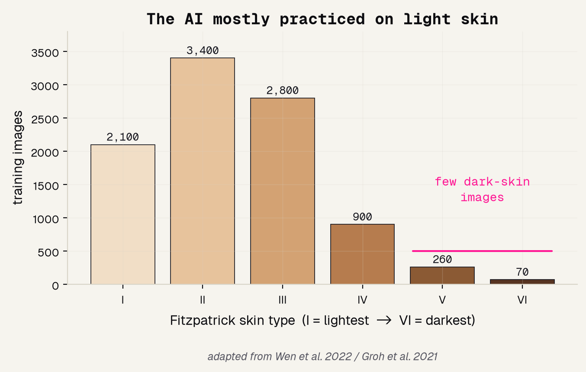
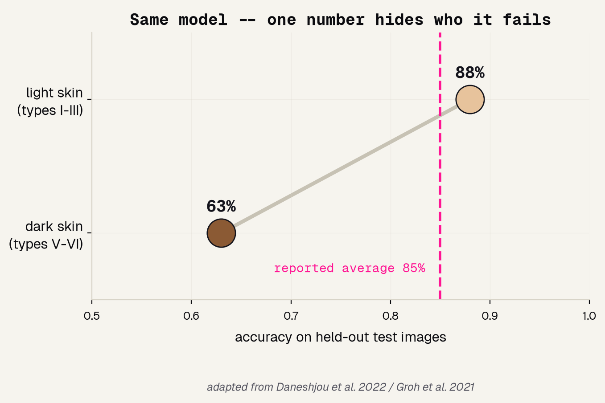
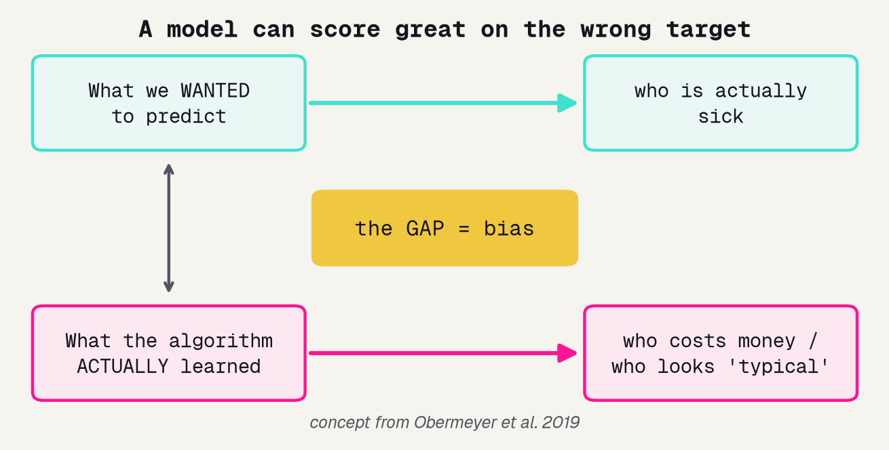
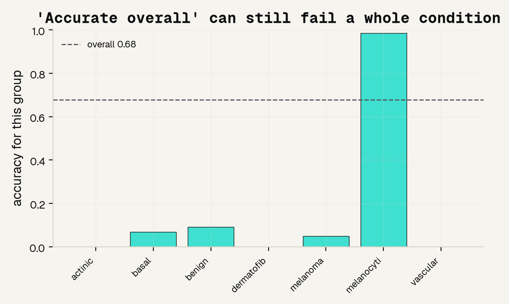
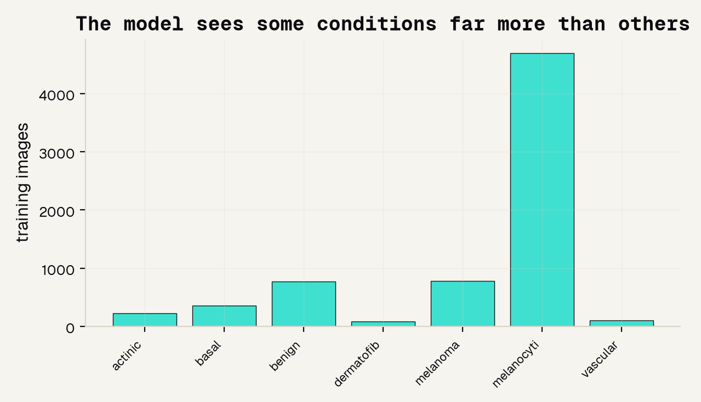
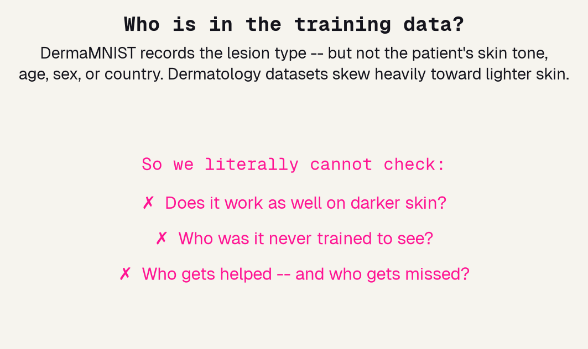

# Background

---

## A promise, and a catch

Skin-cancer AI is pitched as a way to reach the roughly three billion people with little access to a dermatologist. That promise is real, and so is the catch: a model only learns what it is shown, and the images these models learn from are badly skewed toward light skin.

---

## The AI mostly practiced on light skin

A review of twenty-one public skin datasets, over a hundred thousand images, found almost all came from Europe, North America, and Oceania, with almost none labeled as darker skin. On the Fitzpatrick scale the training data piles up on the left and nearly vanishes on the right.

---

## Same model, one number hides who it fails

Groh showed a model is most accurate on the skin types it saw most; Daneshjou showed top models drop sharply on dark skin. Same model, very different results depending on who you are, and the single average number a report shows sits in between and hides it.

---

## Accurate on average can still be unfair

Obermeyer studied a health algorithm used on millions of patients that looked fair on paper but underserved Black patients, because it was trained to predict cost as a stand-in for illness. It scored well on the wrong target. That is the exact suspicion we bring to our own model.

---

# Methods

---

## The same model, a harder question

We use the exact same DermaMNIST skin-lesion model as the screening group: a ResNet18 pretrained on ordinary photos, with a fresh head, sorting images into seven skin conditions. We change nothing about the model. We change the question we ask of it.

---

## The equity lens: break the average apart

The screening group asks how good the model is. We ask a harder question: good for whom? A single accuracy number is a blend, and a blend can hide that one group is being carried by another. So we refuse to trust the average and split the score apart by condition.

---

# Results

---

## The headline number looks fine

Trained and tested on held-out images, the model lands at about sixty-eight percent overall accuracy. Not amazing, not embarrassing, the kind of number you would quietly accept and move on. This is exactly the moment the equity lens says stop and break it apart.

---

## Break it apart: a whole condition is failed

Splitting the same score by condition, the average was hiding a near-total failure. Ordinary moles, the giant class, are caught almost perfectly at ninety-nine percent and prop the average up. Several rarer conditions are caught almost never, some flat at zero.

---

## Why: the model sees some conditions far more

The gap is not mysterious. One class has thousands of training images and the rare conditions have only dozens. Whatever the model sees most, it gets best at. This is the same skew the literature describes for skin tone, along the axis DermaMNIST actually labels.

---

## The blind spot we cannot measure

The gap the literature warns about most is along skin tone, and DermaMNIST ships no skin-tone labels. It records the lesion type and nothing about the patient. So we cannot check the real skin-tone gap here. We can demonstrate the risk of a blind spot, not measure it, and saying so is part of doing this honestly.

---

# Being honest

---

## Who gets left out

The people the pitch was meant to help most are the ones most likely missing from the data. Skin-cancer AI aimed at the three billion with little access serves people disproportionately in regions and skin types barely present in training sets. A tool that is worst where care is scarcest can widen the gap it was sold to close.

---

## References

The equity lens on dermatology AI rests on a specific body of work, from the Fitzpatrick scale that names the groups to the studies that measured the gaps and the proxy-bias case that explains why a fair-looking number can still be unfair.

---
