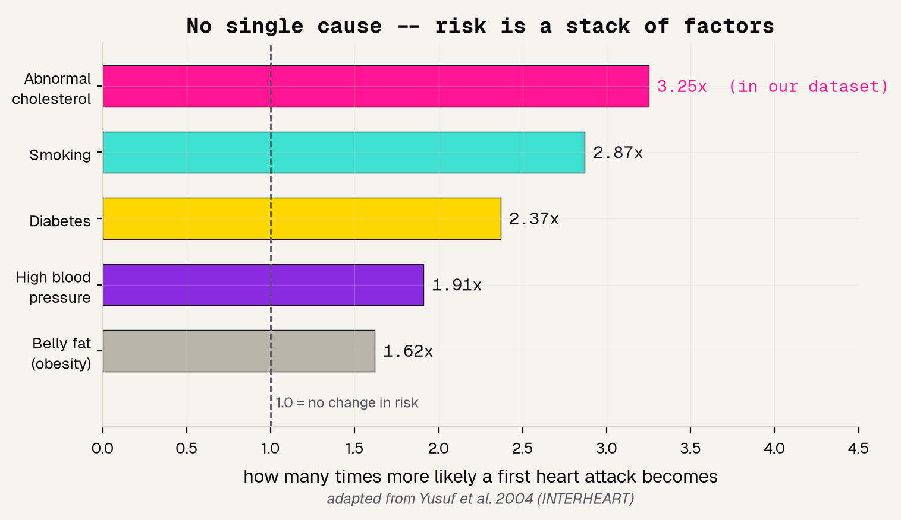
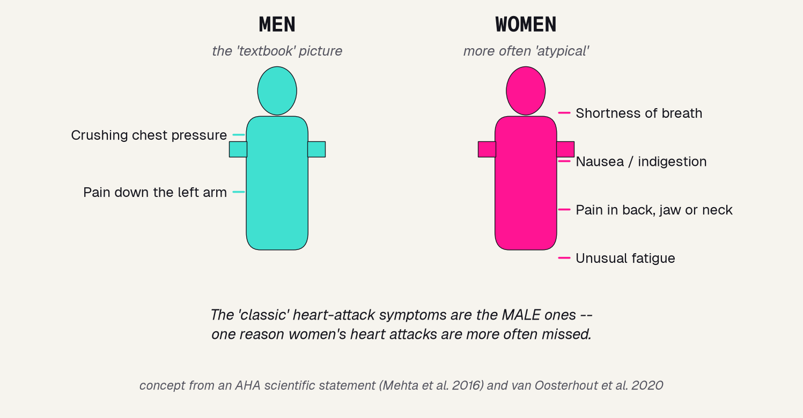
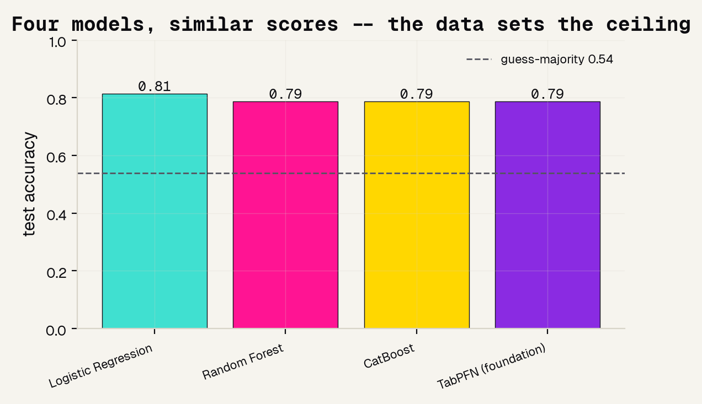
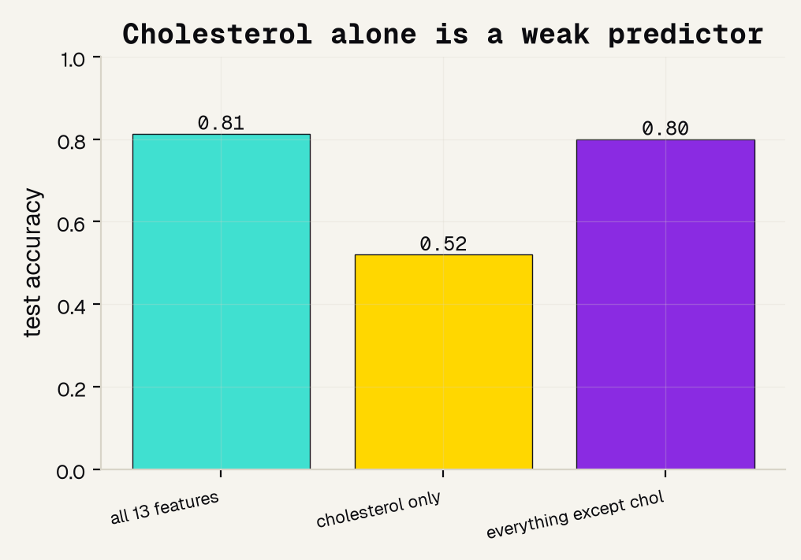
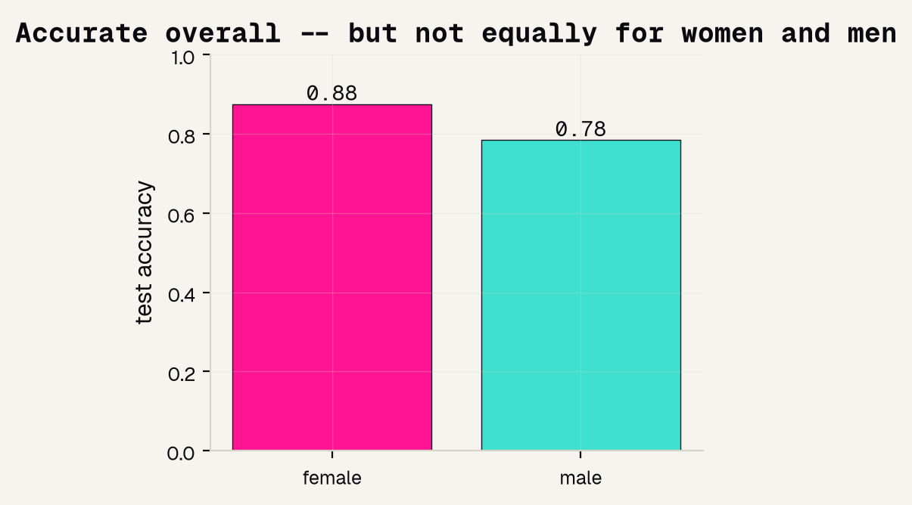
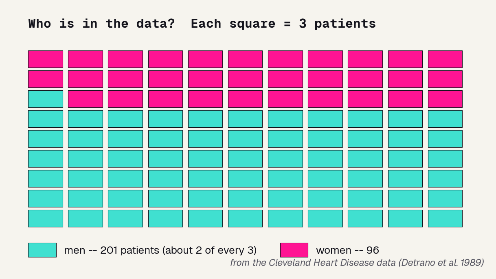

# Background

---

## How doctors actually estimate heart risk

No doctor diagnoses heart disease from one number. They combine several routine checkup measurements into a single risk estimate, the way the Framingham Risk Score does. Worldwide, about nine risk factors led by cholesterol and smoking explain over 90% of first heart attacks. Risk is a stack of factors, not a single cause.

---

## Women's heart disease is under-diagnosed

Here is the problem that drives our project. The "textbook" heart attack, crushing chest pain down the left arm, is the male picture. Women more often feel back pain, nausea, and shortness of breath, so their heart attacks get missed. The American Heart Association documents that women are misdiagnosed and under-treated more than men.

---

# Methods

---

## The task and the data

We predict a yes/no answer, does this patient have heart disease, from a checkup. This is tabular data, rows of numbers, which is the easy part: any standard model handles it without tuning. So the interesting questions are not which model wins, but which clues matter and who the model works for.

### 303 patients
The Cleveland Heart Disease dataset, from a 1980s study.

### 13 features
Age, sex, blood pressure, cholesterol, chest-pain type, exercise-ECG results.

### Predict disease
1 = has heart disease, 0 = does not. Graded on held-out patients.

---

## Four models, one honest test

We train four models and compare their accuracy on patients they never saw. We always compare against the "just guess the more common answer" baseline, about 0.54 here. A real model has to beat that. On clean tabular data, the model choice barely matters, so we spend our effort on the two questions that teach us something.

### Logistic Regression
Simple, explainable, and here the best of the four.

### Random Forest & CatBoost
Tree ensembles, the workhorses of tabular data.

### TabPFN
A foundation model for tables, like the one from Day 2.

---

# Results

---

## The data sets the ceiling

All four models land between 0.79 and 0.81, comfortably above the coin-flip baseline, and they basically tie each other. That is the lesson: on clean tabular data the model barely matters. Swapping a plain logistic regression for a fancy foundation model buys almost nothing. Three hundred patients from the 1980s contain only so much signal, and no model can invent more.

---

## Cholesterol alone is a weak predictor

Everyone "knows" cholesterol causes heart disease, so we gave a model only the cholesterol column. It scored about 0.52, basically a coin flip. Meanwhile the checkup with cholesterol removed scored about 0.80. Cholesterol is a major cause of heart disease over decades, but on its own it is a poor clue for who has disease right now. That is why doctors combine many measurements.

---

## Accurate overall, but not equally by sex

This is the point of the project. One accuracy number can hide unfairness. When we grade the model separately for women and men, it is about 0.88 accurate for women and 0.78 for men, a gap of about 0.09. An accuracy gap in either direction means the model behaves differently depending on your sex. You only see it because you looked.

---

# Being honest

---

## The data is small and male-skewed

A model can only learn from who is in its data, and ours is about 2:1 male. With far fewer women, the model gets less practice on them, and the way patients were selected in the 1980s made the male rows sicker. That skew is not a bug we can fix with a better model, it is a property of the data, and it is exactly the bias that makes heart disease harder to catch in women.

---

## What this project can and cannot say

Being honest about limits is the most important slide in any medical-AI talk. Here is what our toy model earns the right to claim, and what it does not.

### It can
Show that checkup features carry real signal, that no single number is the whole story, and that accuracy can be unequal across sex.

### It cannot
Say anything trustworthy about today's patients. This is 303 people from one 1980s study.

### Watch the metric
Missing a real heart attack is far worse than a false alarm. A deployed tool would be tuned for sensitivity, not raw accuracy.

---

# References

---

## Sources

Every claim in this deck traces to a real, peer-reviewed source. The dataset is the public Cleveland Heart Disease set curated from Detrano 1989.

### Cardiac risk scoring
Wilson 1998, Framingham Risk Score, Circulation. Yusuf 2004, the INTERHEART study, Lancet.

### Under-diagnosis in women
Mehta 2016, AHA scientific statement, Circulation. van Oosterhout 2020, JAHA. Bugiardini and Bairey Merz 2005, JAMA.

### The dataset
Detrano 1989, American Journal of Cardiology. UCI Machine Learning Repository, Heart Disease Data Set.
