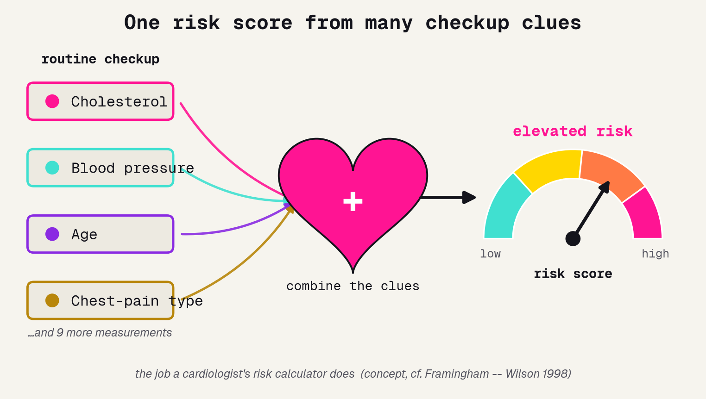
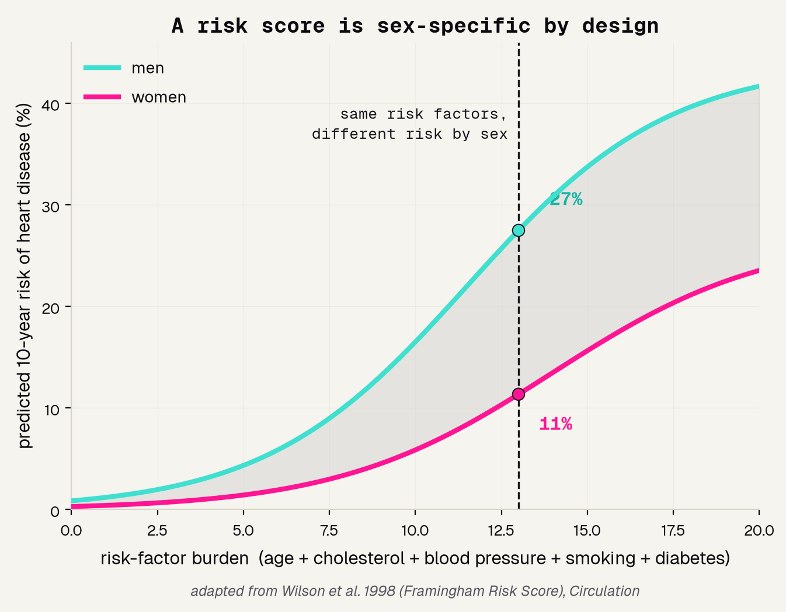
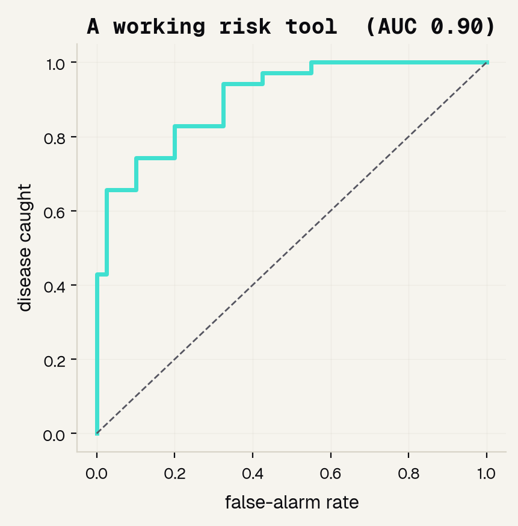
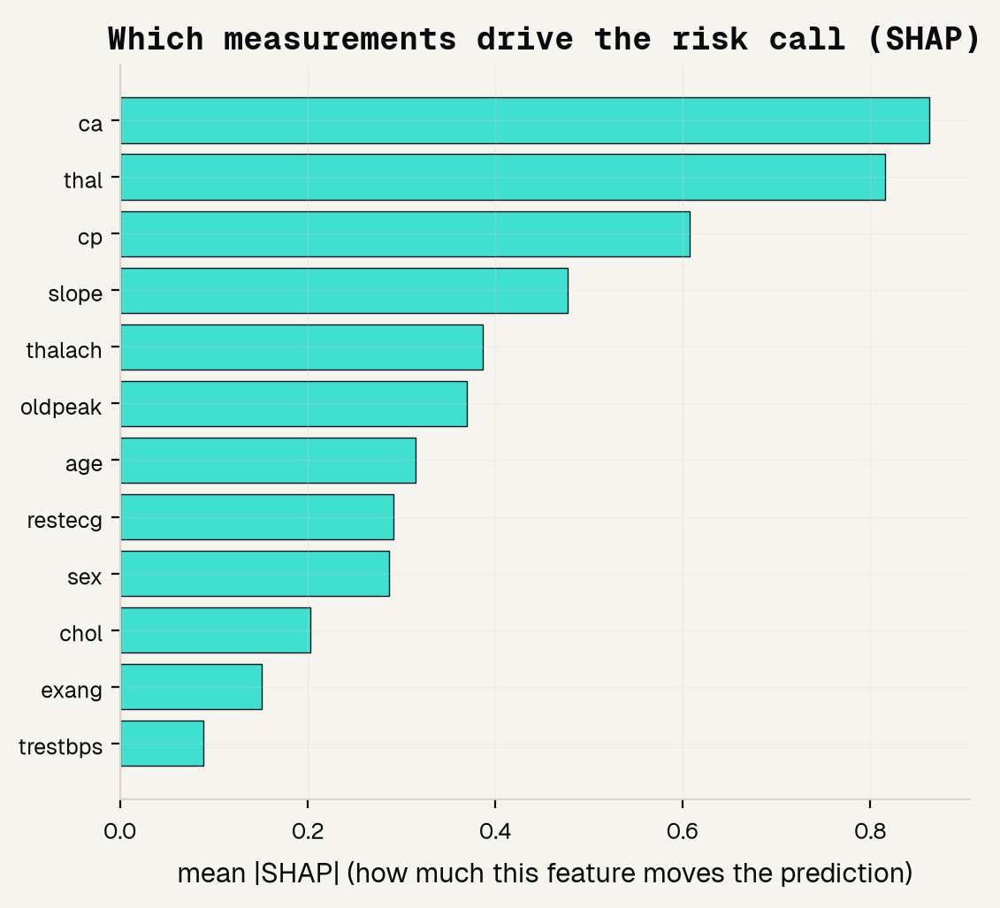

# Background

---

## One risk score from many clues

A doctor never diagnoses heart disease from a single number. They combine many routine checkup measurements -- cholesterol, blood pressure, age, chest-pain type -- into one risk estimate. That is exactly the job we are asking a model to learn.

---

## Doctors already do this math

The Framingham Risk Score has combined checkup clues into a 10-year risk since 1998, and it is deliberately sex-specific: men and women with the same risk factors sit on different curves. Our model is a small, honest version of the same idea.

---

## No single cause: risk is a stack

The worldwide INTERHEART study found that about nine risk factors, led by abnormal cholesterol and smoking, explain over 90% of first heart attacks. No one clue is the whole story, which is why a checkup measures many at once.

---

## The textbook heart attack is the male one

Women more often feel a heart attack as back pain, nausea, or shortness of breath rather than the classic crushing chest pain. Because the textbook picture is the male one, women's heart attacks are more often missed. This is the fairness problem we keep watching.

---

# The data

---

## Why the Cleveland dataset

We need real clinical data, freely available to learn on, that records who each patient is so we can check fairness. The UCI Cleveland Heart Disease set gives us all three, which is exactly why it is the right dataset for a first risk tool.

### 303 patients
Real clinical records from a 1980s coronary-disease study, each with a verified yes/no answer.

### 13 features
Ordinary checkup numbers -- age, blood pressure, cholesterol, chest-pain type, exercise-test results.

### Free and open
Downloads straight from the UCI repository, no gate or login -- and it records sex, so we can audit fairness.

---

## Who is in the data?

The golden rule is to look at the data before you model. The very first thing to check here, because our whole project is about fairness, is who the data actually contains. It is roughly two men for every woman.

---

# The model

---

## Four models, one bake-off

We did not guess which model to use -- we ran a bake-off, training four models the same way and grading each on patients it never saw. Logistic Regression, Random Forest, CatBoost, and a TabPFN foundation model all landed in a tie.

---

## Model and data processing

Here is the exact recipe, so anyone could reproduce it. One clean train and test split, all 13 features, graded only on held-out patients, with CatBoost giving the calibrated probability we grade by AUC.

---

# Results

---

## A working risk tool

How we grade a risk tool: the ROC curve sweeps every cut-off and plots disease caught against false alarms, and AUC is the area underneath, where 0.5 is a coin flip and 1.0 is perfect. Graded this way, our tool scores 0.90.

---

## Which clues drive the call

Feature importance for a table is SHAP: it measures how much each measurement moves the prediction. The heavy hitters are the imaging and stress-test results and chest-pain type -- and cholesterol, surprisingly, sits near the bottom.

---

## Cholesterol alone is a weak clue

Everyone knows cholesterol matters for the heart, so here is a fair test: give the model only cholesterol. It scores barely better than a coin flip, while the checkup without cholesterol stays strong. Causing disease slowly is not the same as detecting it today.

---

## Does it work for women and men?

The point of the whole project: one accuracy number can hide unfairness. So we grade the model separately for each sex. It is more accurate for women than men -- a real gap, and an honest consequence of the 2:1 male data.

---

# The honest picture

---

## What it can and cannot do

A good project names its own limits out loud. Ours is a genuinely working risk tool, but it is not ready for a patient, and here is exactly where the line sits.

### It works
A real risk tool on real checkup data: AUC 0.90, leaning on the same cues a cardiologist uses.

### But it is skewed
The accuracy gap by sex is real, and the data is about 2:1 male, so it may serve women worse.

### A real tool
Would use today's diverse patients, a sex-specific design, multi-hospital validation, and a clinician in the loop.

---

## References

The seven papers behind this project, from the landmark risk scores to the statements on why women get under-diagnosed.

### Foundations and data
[1] Detrano et al. 1989, Am J Cardiol (the Cleveland dataset). [2] Wilson et al. 1998, Circulation (Framingham Risk Score). [3] Yusuf et al. 2004, Lancet (INTERHEART). [7] UCI Machine Learning Repository.

### Sex differences and under-diagnosis
[4] Mehta et al. 2016, Circulation (AHA statement on heart attacks in women). [5] van Oosterhout et al. 2020, JAHA (symptom differences). [6] Bugiardini and Bairey Merz 2005, JAMA (angina with normal arteries).

---

## The honest bottom line

A risk tool earns trust by grading with the right metric, asking which clues actually matter, and checking who it works for. Use this to learn that judgment -- then use a validated, sex-specific tool and a real clinician to actually care for a patient.
