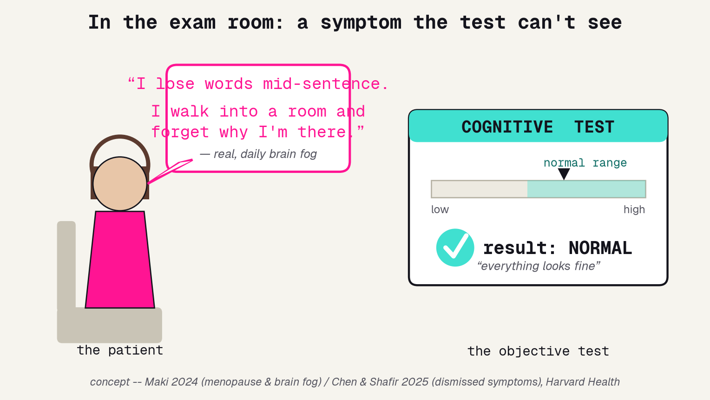
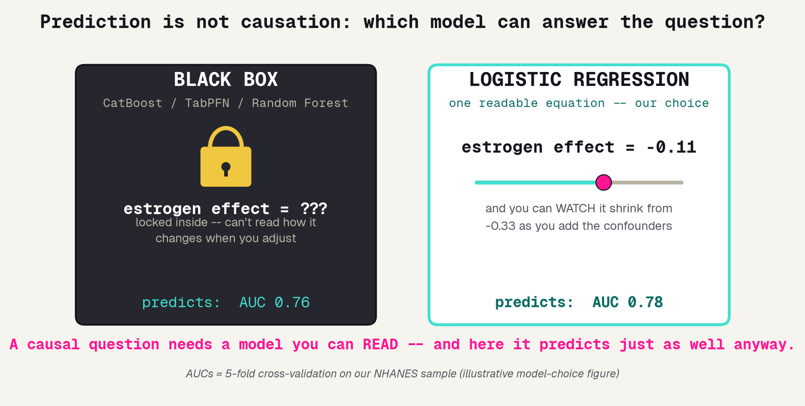
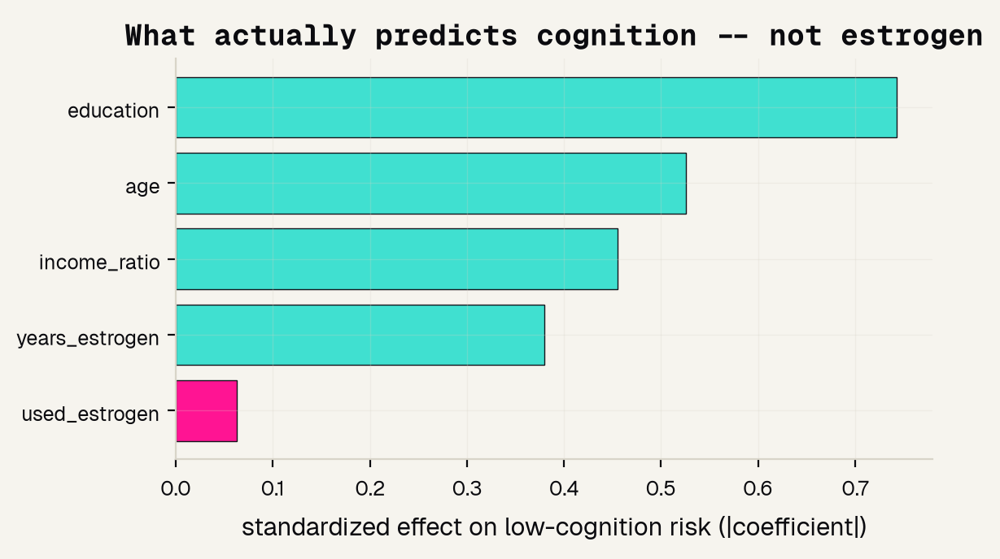

# Background

---

## The visit no test explains

A woman in her sixties describes daily brain fog -- losing words, forgetting why she walked into a room -- and the objective memory test comes back normal. The number on the chart cannot see what she is living. That gap is where this project starts.

---

## The tests say fine; she says not fine

Measured side by side, most women's objective cognitive scores land in the normal band, yet their self-reported brain fog is high and scattered. The lines cross. A good analyst takes both the number and the patient's account as real evidence.

---

## Twenty years of watching said estrogen helps

For years, studies that simply watched women found estrogen users got Alzheimer's less often. Then a trial let a coin flip decide who got hormones, and the benefit did not just vanish, it reversed. Same drug, opposite answer.

---

## Why watching lied: healthy-user bias

The women who chose hormone therapy were also richer, more active, and saw doctors more often to begin with. That hidden head start drives both the drug use and the good memory, so the direct link only looks like cause.

---

# The data

---

## Why NHANES

We need a real, national sample where each woman has both an objective cognition score and whether she used estrogen, plus the background facts that make confounding checkable. NHANES gives us all three.

### 739 women
All age 60+, from the NHANES 2013-14 US national health survey.

### Used estrogen?
Whether she ever took female hormones -- the treatment we are studying.

### Her background
Age, education, and family income -- the confounders we must adjust for.

### Memory score
A digit-symbol test; higher is sharper. We study who lands in the weaker half.

---

## The honest question we can actually ask

We cannot randomly assign estrogen in a survey, so we cannot prove cause. But we can ask a narrower, honest question, and the answer to it is the whole deliverable.

---

# The model

---

## Prediction is not causation

A causal question needs a model whose estrogen effect you can read as one number and watch change. A black box predicts but locks that number away. Here it does not even predict better, so the choice is easy.

---

## Why logistic regression, and the exact recipe

We choose logistic regression because its coefficient for estrogen is the effect size we read, and we can watch it shrink as we add confounders. Here is the full pipeline, so anyone could reproduce it.

---

# The results

---

## The tempting headline

The naive look anyone would take first: average the memory score for users versus non-users. Users come out about eight points ahead. Taken at face value, the exciting headline writes itself.

---

## Most of the gap was confounding

Now the honest test: measure estrogen's effect alone, then again after adjusting for age, education, and income. The effect collapses from crude to adjusted. Two-thirds of the apparent benefit was never the pill.

---

## What actually predicts cognition

Feature importance comes free from the same interpretable model: the standardized coefficients. Education and age dominate, and estrogen is the smallest bar. Prediction and causation agree, and neither points at the pill.

---

## Can it even predict?

The causal answer is the deliverable, but it is fair to ask how well the model predicts low cognition at all. Measured honestly with cross-validation, it clears a real signal -- driven by age and education, not estrogen.

---

## Does it work for both groups?

Measured by accuracy computed separately for each group, the model is a bit stronger for estrogen-users than for non-users. Naming that gap out loud is the honest move, the same habit you practiced all week.

---

# The takeaway

---

## What a survey can and cannot do

A good project names its own limits out loud. Ours shows a tempting headline is mostly a mirage, but it stops short of proving cause, and it says exactly what would.

### What it can do
Show a headline is mostly a mirage, and that adjusting shrinks the effect by 67%.

### What it cannot do
Prove cause -- we only corrected for confounders we measured and thought of.

### What settles it
A randomized trial, where a coin flip assigns the drug, so the groups start the same.

---

## References

The eight papers behind this project, from the observational clues to the trial that overturned them, plus the healthy-user-bias and brain-fog primers.

### Observational and trial
[1] Tang et al. 1996, Lancet. [2] Zandi et al. 2002, JAMA (Cache County). [3] Shumaker et al. 2003, JAMA (WHIMS dementia). [4] Rapp et al. 2003, JAMA (WHIMS cognition).

### Bias and symptoms
[5] Wharton et al. 2009, Maturitas (healthy-user bias). [6] Vandenbroucke 2009, Lancet. [7] Maki 2024, Harvard Health (brain fog). [8] Chen and Shafir 2025, Harvard Health (dismissed symptoms).

---

## The one habit to carry with you

When a group that chose a treatment looks healthier, the head start usually belongs to the person, not the pill -- and only a coin-flip experiment can promote a correlation to a cause. And take the patient's account seriously, even when the test says fine.
