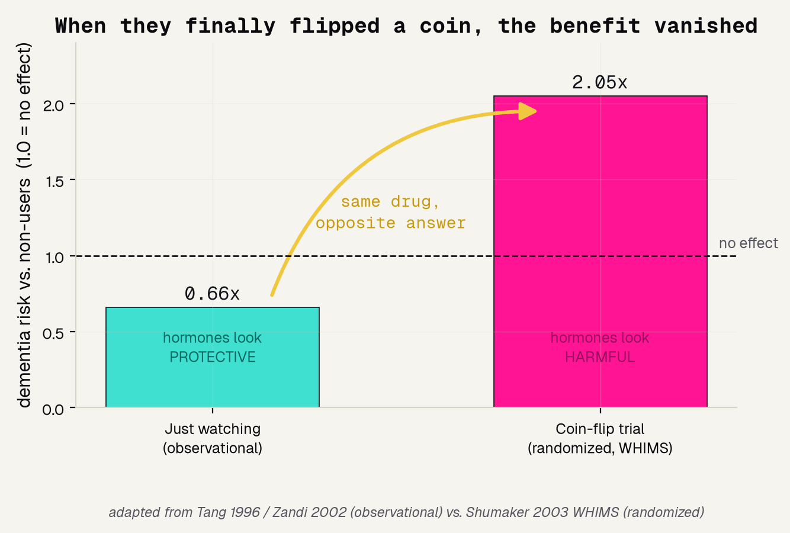
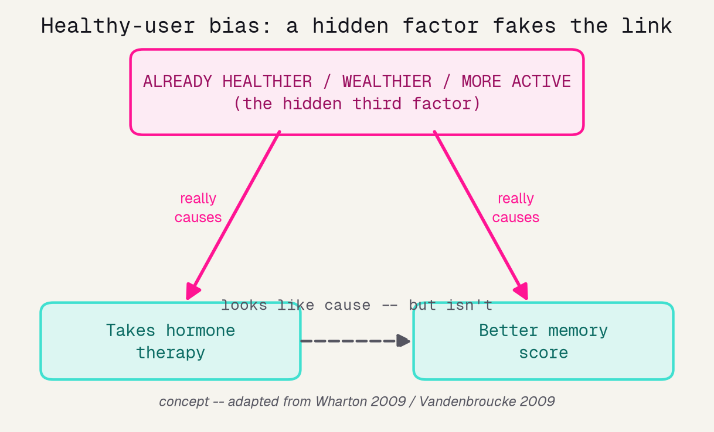
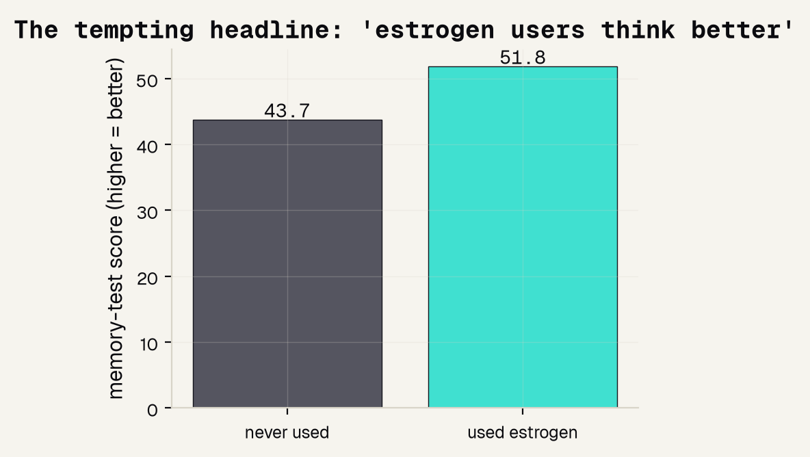
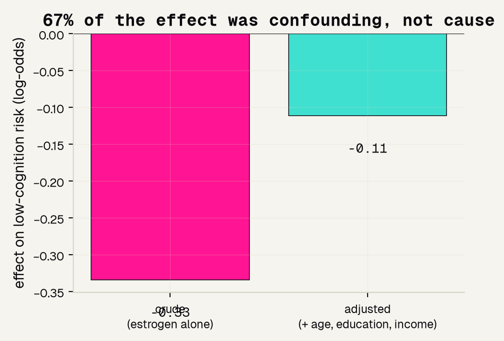
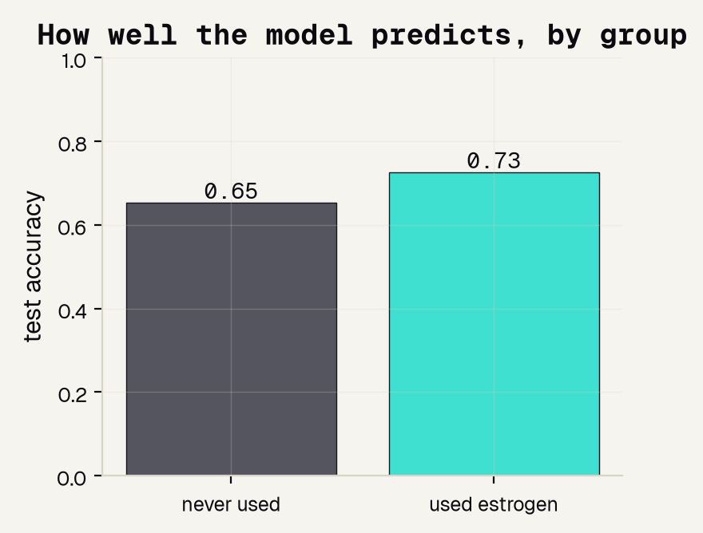
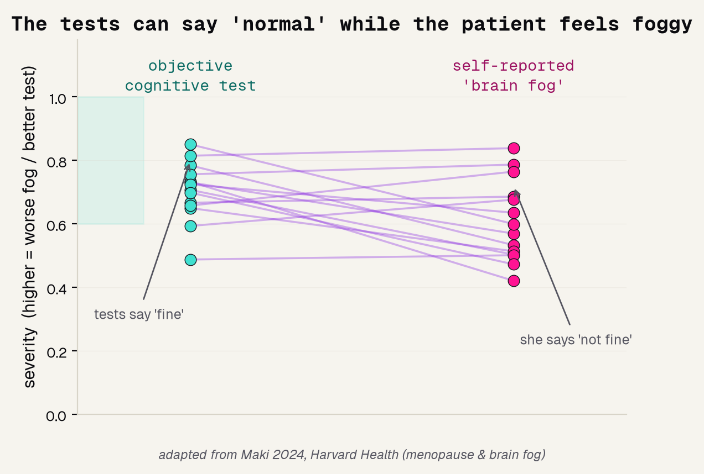

# Background

---

## A twenty-year detective story

For years, studies that just watched women found estrogen users had sharper memory and less dementia. It looked like proof the pills protected the brain. Then a real experiment said the opposite. This is the story of why.

---

## When they flipped a coin, the benefit vanished

The single most important slide. Just watching said hormones protect the brain; a randomized trial said they harm it. Same drug, opposite answer.

---

## Healthy-user bias: a hidden third factor

The women who chose hormones were already healthier, wealthier, and more active. That hidden factor drove both the drug use and the good memory, faking a link that was never cause.

---

## Ice cream and shark attacks

The same trap in a picture everyone already knows. When two things move together, always ask whether a hidden third factor is quietly driving both.

---

# Methods

---

## Our data: NHANES women 60 and older

A real government health survey. For each woman we know whether she ever used estrogen, her background, and her score on a memory-and-attention test.

---

## The one question we can actually ask

We cannot randomly assign estrogen in a survey. But we can ask: does the estrogen effect survive once we account for the background differences between users and non-users?

---

# Results

---

## The tempting headline

Take the naive look first. Average the memory-test score for users versus non-users, and users are eight points ahead. That is exactly the exciting clue the early studies chased.

---

## Two-thirds of the effect was confounding

Now the honest test. Adjust for age, education, and income, and most of the estrogen effect melts away. Two-thirds of the apparent benefit was never the pill.

---

## Does the model work for everyone?

A fairness check. One model, two groups. It is noticeably more accurate for estrogen-users than for non-users, and naming that gap out loud is the honest move.

---

# What the numbers can't capture

---

## The tests say "fine"; she says "not fine"

Our data is a test score. But many women report real daily brain fog even when the test looks normal. The number and the lived experience can disagree, and both are evidence.

---

## A survey can hint; only an experiment proves

What this analysis can and cannot do. Adjusting exposes confounding, but it can only correct for what we measured. Proving cause needs a coin flip, not a survey.

---

## References

The papers and articles behind this project, from the first observational clue to the trial that overturned it.

---

## The one habit to carry out the door

When a group that chose a treatment looks healthier, suspect the chooser, not the treatment. And take the patient's account seriously, even when the test says fine.
